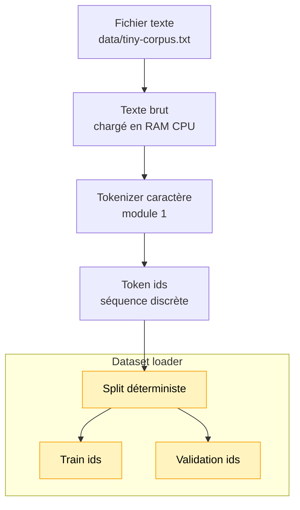

# Module 2 — Dataset loader

Ce module lit un fichier `.txt`, encode son contenu avec un tokenizer, puis sépare les ids
en deux parties: train et validation.

Il ne construit pas encore de batch, de paire entrée/cible, de tenseur ou de modèle.

## Pourquoi ce module existe

Un LLM apprend à partir de séquences observées. Avant de parler de probabilités ou de
réseaux de neurones, il faut donc transformer un corpus texte en longue séquence d'ids:

```text
fichier texte -> texte brut -> ids -> train / validation
```

Le module 1 convertissait du texte en nombres. Ce module organise ces nombres comme un
dataset minimal.

## Pipeline

Ce module dépend volontairement du tokenizer:

```text
1. Lire le fichier texte
2. Construire le tokenizer à partir du texte
3. Encoder le texte avec ce tokenizer
4. Séparer les ids en train et validation
```

On construit d'abord le tokenizer, car le dataset n'est pas une simple chaîne de caractères:
c'est une séquence d'ids numériques. Le loader fait donc le pont entre le texte brut et les
modules statistiques suivants.

## Schéma progressif



Le module 2 ajoute l'organisation du corpus: les ids ne sont plus seulement une liste brute,
ils sont séparés en données d'apprentissage et de validation.

## Concepts

- **Fichier texte**: source lisible par un humain, ici un petit `.txt`.
- **Texte brut**: contenu exact du fichier après lecture UTF-8.
- **Token ids**: séquence numérique produite par le tokenizer.
- **Train split**: partie principale qui servira plus tard à apprendre.
- **Validation split**: petite partie mise de côté pour observer si le modèle généralise un peu.

Mathématiquement, le corpus devient une séquence discrète:

```text
x = [id0, id1, id2, id3, ...]
```

Les modules suivants apprendront à exploiter cette séquence, mais ce module se limite à la
préparer.

## Exemple

```ts
import { createCharacterTokenizer, createTokenDataset, loadTextFile } from '../../index.js'

const rawText = await loadTextFile('data/tiny-corpus.txt')
const tokenizer = createCharacterTokenizer(rawText)
const dataset = createTokenDataset(rawText, tokenizer)

console.info(dataset.totalTokens)
console.info(dataset.trainTokenIds)
console.info(dataset.validationTokenIds)
```

Pour lancer une démo exécutable:

```bash
npm run demo:02-dataset
```

## Mini corpus

Le fichier `data/tiny-corpus.txt` est volontairement court et répétitif. Il n'est pas fait
pour produire un bon modèle; il sert à voir clairement comment les motifs textuels deviennent
des motifs dans une séquence d'ids.

## Impact mémoire / VRAM

Le loader charge tout le fichier en RAM CPU et garde les ids dans des tableaux JavaScript.
Il ne crée aucun tenseur et n'utilise pas le GPU: la VRAM consommée est donc 0.

Le compromis est assumé: c'est simple et lisible, mais pas adapté à de gros corpus.

## Limites

- Le fichier est lu entièrement en mémoire.
- Le texte est supposé être en UTF-8.
- Il n'y a pas de streaming.
- Il n'y a pas encore de batching.
- Il n'y a pas encore de paires `(entrée, cible)` pour l'entraînement.
