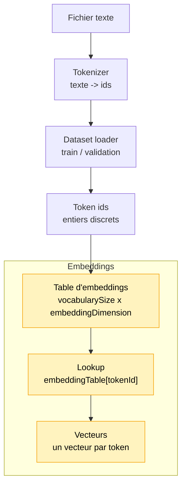

# Module 4 — Embeddings CPU

Ce module associe chaque token id à un vecteur de nombres. Il reste volontairement CPU-only:
pas de TensorFlow.js, pas de tenseurs, pas de gradients et pas encore d'entraînement.

## Pourquoi ce module existe

Un id de token est une étiquette arbitraire. Le nombre `12` ne veut pas dire que le token est
naturellement proche du token `13`. Pour donner au modèle une représentation manipulable, on
remplace donc chaque id par un vecteur:

```text
token id -> ligne dans une matrice d'embeddings -> vecteur
```

## Pipeline

Ce module arrive après le tokenizer et le dataset loader:

```text
1. Lire le fichier texte
2. Construire le tokenizer
3. Créer le dataset de token ids
4. Créer une table d'embeddings
5. Transformer des ids en vecteurs
```

Le module ne modifie pas encore les vecteurs par apprentissage. Il crée seulement une table
initialisée de façon déterministe pour rendre le mécanisme observable.

## Schéma progressif



Le module 4 change la représentation: les ids restent des indices discrets, mais chaque id
peut maintenant être remplacé par un vecteur numérique.

## Concepts

- **Embedding**: vecteur associé à un token.
- **Table d'embeddings**: matrice de shape `vocabularySize x embeddingDimension`.
- **Lookup**: opération `embeddingTable[tokenId]`.
- **Séquence embeddée**: séquence d'ids transformée en séquence de vecteurs.
- **Similarité cosinus**: mesure d'angle entre deux vecteurs, utile pour l'inspection.

`embeddingDimension` est le nombre de valeurs dans chaque vecteur. Avec une dimension 4, un
token devient par exemple `[0.01, -0.02, 0.00, 0.03]`. Plus cette dimension est grande, plus
le modèle a de place pour représenter des nuances, mais plus la table consomme de mémoire.
Dans ce module, on garde une petite dimension pour que les vecteurs restent lisibles.

La similarité cosinus aide à comparer deux vecteurs, mais elle ne prouve pas que le modèle
comprend leur sens. Dans ce module, les vecteurs sont initialisés, pas appris.

Intuitivement, elle regarde si deux vecteurs pointent dans une direction proche:

```text
1    -> même direction
0    -> directions indépendantes ou orthogonales
-1   -> directions opposées
```

Son intérêt ici est surtout pédagogique: elle donne une première façon de manipuler les
vecteurs comme des objets géométriques. Plus tard, après entraînement, des tokens utilisés
dans des contextes proches pourraient finir avec des vecteurs plus proches. Dans ce module,
ce n'est pas encore le cas: les valeurs sont seulement initialisées.

## Exemple

```ts
import { createEmbeddingTable } from './index.js'

const table = createEmbeddingTable({
    vocabularySize: 20,
    embeddingDimension: 4,
    seed: 123,
})

console.info(table.getEmbedding(0))
console.info(table.embedSequence([0, 1, 2]))
```

Pour lancer une démo exécutable:

```bash
npm run demo:04-embeddings
```

La démo affiche d'abord un exemple avec `le`, puis, dans un terminal interactif, elle permet
de saisir une ou plusieurs lettres du vocabulaire. Appuie sur `ENTRÉE` pour valider et sur
`ESC` pour quitter.

## Impact mémoire / VRAM

La table est stockée en RAM CPU dans un `number[][]`. La VRAM consommée est donc 0.

La mémoire augmente avec:

```text
vocabularySize x embeddingDimension
```

Avec un petit vocabulaire caractère et une dimension 4 dans la démo, l'impact est minuscule.

## Limites

- Les vecteurs ne sont pas appris.
- Les similarités ne portent pas encore de sens linguistique fiable.
- Il n'y a pas de TensorFlow.js.
- Il n'y a pas de gradients.
- Il n'y a pas encore de self-attention.
