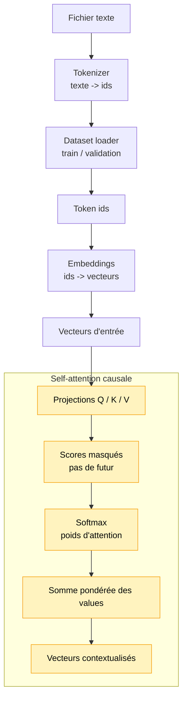

# Module 5 — Self-attention causale CPU

Ce module transforme une séquence de vecteurs en nouveaux vecteurs contextualisés. Un
embedding isolé représente un token seul; la self-attention permet à chaque position de
regarder les positions précédentes pour mélanger de l'information de contexte.

Il reste volontairement CPU-only: pas de TensorFlow.js, pas de tenseurs, pas de gradients,
pas de multi-head attention et pas encore de transformer block complet.

## Pourquoi ce module existe

Dans un LLM, le sens d'un token dépend fortement de son contexte. La lettre ou le mot courant
ne suffit pas toujours: on veut savoir ce qui vient avant. La self-attention répond à cette
question:

```text
Pour chaque position, quelles positions précédentes sont utiles ?
```

Elle produit alors un nouveau vecteur pour chaque position, construit comme une somme
pondérée des informations accessibles.

## Pourquoi parler de positions ?

Jusqu'ici, on manipulait surtout des séquences:

```text
[id0, id1, id2]
```

ou:

```text
[embedding0, embedding1, embedding2]
```

Mais dans un LLM, chaque élément de la séquence occupe une **position**:

```text
position 0 -> premier token
position 1 -> deuxième token
position 2 -> troisième token
```

La self-attention calcule une nouvelle représentation **pour chaque position**. La position
1 ne remplace pas la position 0: elle produit son propre vecteur contextualisé en regardant
les positions autorisées.

Avec un masque causal:

```text
position 0 peut regarder: 0
position 1 peut regarder: 0, 1
position 2 peut regarder: 0, 1, 2
```

Cette contrainte est essentielle pour un LLM autorégressif: quand le modèle prédit le token
suivant, il ne doit pas tricher en regardant les tokens futurs.

Important: dans ce module, on ne crée pas encore de **positional encoding**. On utilise les
positions pour appliquer le masque causal et organiser les calculs d'attention. L'ajout
d'une information de position dans les vecteurs eux-mêmes pourra venir plus tard, quand on
assemblera un bloc Transformer plus complet.

## Pipeline

Ce module arrive après les embeddings:

```text
1. Lire le fichier texte
2. Construire le tokenizer
3. Créer le dataset de token ids
4. Transformer les ids en embeddings
5. Appliquer la self-attention causale sur ces vecteurs
```

## Schéma progressif



Le module 5 ajoute la communication entre positions: chaque vecteur peut mélanger des
informations venant des positions précédentes autorisées par le masque causal.

## Concepts

- **Query (Q)**: ce que la position cherche.
- **Key (K)**: ce que chaque position annonce pour être retrouvée.
- **Value (V)**: l'information qui sera vraiment copiée ou mélangée.
- **Score d'attention**: compatibilité entre une query et une key.
- **Softmax**: transformation des scores en poids qui somment à 1.
- **Masque causal**: interdiction de regarder les positions futures.

La formule centrale est:

```text
score(i, j) = dot(query_i, key_j) / sqrt(attentionDimension)
weights_i = softmax(scores_i)
output_i = somme_j weights_i[j] * value_j
```

La division par `sqrt(attentionDimension)` évite que les scores deviennent trop grands quand
les vecteurs ont beaucoup de dimensions. Le softmax resterait mathématiquement valide, mais
il deviendrait souvent trop extrême.

## Q, K, V avec une analogie dev

Une bonne analogie est un petit moteur de recherche interne:

```text
Query = la requête de recherche
Key   = l'index ou les métadonnées qui permettent de retrouver une entrée
Value = le contenu que l'on récupère si l'entrée est jugée pertinente
```

Chaque position fabrique donc trois versions de son embedding:

```text
embedding_i -> query_i
embedding_i -> key_i
embedding_i -> value_i
```

Pour produire la sortie de la position `i`:

1. `query_i` demande: "qu'est-ce qui m'est utile dans le contexte ?"
2. On compare `query_i` aux `key_j` des positions autorisées.
3. Ces comparaisons donnent des scores.
4. Le softmax transforme les scores en poids.
5. On mélange les `value_j` avec ces poids.

On ne mélange pas les keys: les keys servent à être trouvées. Ce sont les values qui portent
l'information récupérée.

Version courte:

```text
Q cherche
K permet de comparer
V transporte l'information
```

Pourquoi trois projections au lieu d'un seul vecteur ? Parce que "servir à être retrouvé",
"chercher quelque chose" et "fournir du contenu" sont trois rôles différents. C'est le même
genre de séparation que dans une application où un objet peut avoir un champ d'indexation et
un champ de contenu.

## Exemple concret avec `llm`

Prenons une séquence de trois caractères:

```text
position 0 -> "l"
position 1 -> "l"
position 2 -> "m"
```

Chaque position a son propre embedding, puis ses propres projections:

```text
"l" position 0 -> Q0, K0, V0
"l" position 1 -> Q1, K1, V1
"m" position 2 -> Q2, K2, V2
```

Même si les deux premiers caractères sont tous les deux `"l"`, ils occupent deux positions
différentes. Dans ce module, comme on n'a pas encore de positional encoding, leurs embeddings
de départ seront identiques. Mais leur **sortie contextualisée** peut différer, car la
position 0 et la position 1 n'ont pas accès au même contexte.

Avec le masque causal:

```text
position 0 peut regarder: position 0
position 1 peut regarder: position 0, position 1
position 2 peut regarder: position 0, position 1, position 2
```

Donc pour la position 0:

```text
output0 = 1.0 * V0
```

Elle n'a pas de passé et ne peut pas regarder le futur. Son vecteur contextualisé est donc
exactement sa value.

Pour la position 1:

```text
score(1, 0) = dot(Q1, K0) / sqrt(attentionDimension)
score(1, 1) = dot(Q1, K1) / sqrt(attentionDimension)
weights1 = softmax([score(1, 0), score(1, 1)])
output1 = weights1[0] * V0 + weights1[1] * V1
```

Cette fois, le deuxième `"l"` peut mélanger sa propre information avec celle du premier
`"l"`. Son vecteur contextualisé peut donc être différent de sa simple value.

Pour la position 2:

```text
output2 = weights2[0] * V0 + weights2[1] * V1 + weights2[2] * V2
```

Le `"m"` peut regarder toute la séquence disponible jusque-là: les deux `"l"` précédents et
lui-même.

Point important: les keys ne sont pas mélangées dans la sortie. Les keys servent à calculer
les poids. Ce sont les values qui sont mélangées.

## Pourquoi Q, K et V sont initialisés aléatoirement ?

Les matrices `queryWeights`, `keyWeights` et `valueWeights` sont les paramètres qui
transforment un embedding en query, key et value.

Dans un vrai Transformer, elles sont généralement initialisées avec de petites valeurs
aléatoires, puis modifiées pendant l'entraînement. Au départ, elles ne savent rien faire de
spécial. La training loop les ajuste progressivement pour produire de meilleures queries,
keys et values.

Dans ce module, il n'y a pas encore d'entraînement. Les matrices restent donc aléatoires,
mais avec une seed déterministe:

```text
même seed -> mêmes matrices -> mêmes sorties de démo
```

Le but n'est pas encore d'obtenir une attention intelligente. Le but est de voir le mécanisme:

```text
embedding -> Q/K/V -> scores -> softmax -> somme pondérée des values
```

## Exemple

```ts
import { createSelfAttention } from './index.js'

const attention = createSelfAttention({
    embeddingDimension: 4,
    attentionDimension: 4,
    seed: 123,
})

const result = attention.applyCausalSelfAttention([
    [0.1, 0.2, 0.3, 0.4],
    [0.2, 0.1, 0.0, 0.3],
])

console.info(result.attentionWeights)
console.info(result.outputVectors)
```

Pour lancer une démo exécutable:

```bash
npm run demo:05-attention
```

La démo affiche d'abord un exemple avec `llm`, puis, dans un terminal interactif, elle permet
de saisir une ou plusieurs lettres du vocabulaire. Appuie sur `ENTRÉE` pour valider et sur
`ESC` pour quitter.

## Impact mémoire / VRAM

Tout est stocké en tableaux JavaScript CPU. La VRAM consommée est donc 0.

Le coût principal vient de la matrice de scores:

```text
séquenceLength x séquenceLength
```

Ici les séquences de démo sont minuscules, donc le coût est négligeable. Dans un vrai LLM,
cette croissance quadratique est une des raisons pour lesquelles l'attention devient chère.

## Limites

- Une seule tête d'attention.
- Projections déterministes, pas apprises.
- Pas de layer norm.
- Pas de connexion résiduelle.
- Pas de feed-forward network.
- Pas encore de training loop.
