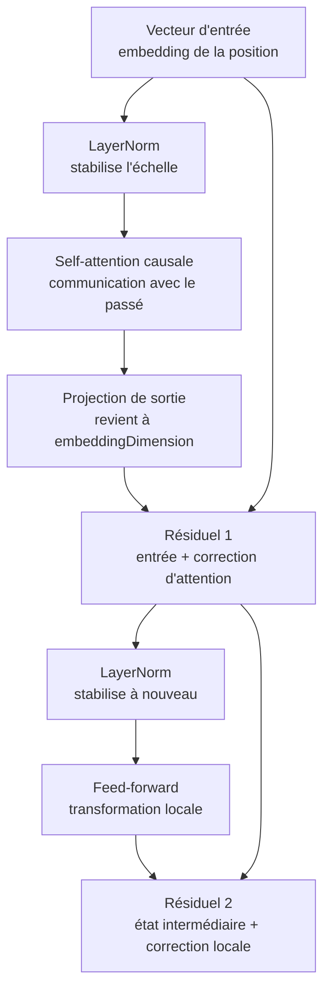

# Module 6 — Transformer block CPU

Ce module assemble plusieurs briques déjà vues pour former un bloc Transformer minimal. Un
bloc Transformer reçoit une séquence de vecteurs et renvoie une séquence de vecteurs de même
dimension. Cette propriété est importante: plus tard, on pourra empiler plusieurs blocs.

Il reste volontairement CPU-only: pas de TensorFlow.js, pas de tenseurs, pas de gradients,
pas de dropout et pas encore de training loop.

## Pourquoi ce module existe

La self-attention du module 5 permet aux positions de communiquer entre elles. Mais un bloc
Transformer complet ne se limite pas à cette communication. Il ajoute aussi:

- une normalisation pour stabiliser les valeurs;
- des connexions résiduelles pour conserver l'état précédent;
- un feed-forward pour transformer chaque position localement.

Version courte:

```text
attention = communication entre tokens
feed-forward = transformation locale par token
residual = conservation + correction
layer norm = stabilité numérique
```

## Pipeline

Ce module arrive après les embeddings et la self-attention:

```text
1. Lire le fichier texte
2. Construire le tokenizer
3. Créer le dataset de token ids
4. Transformer les ids en embeddings
5. Appliquer un bloc Transformer
```

Dans ce module, le bloc utilise une structure dite `pre-norm`:

```text
LayerNorm -> Self-Attention -> Residual
LayerNorm -> Feed-Forward  -> Residual
```

`pre-norm` veut simplement dire que l'on normalise avant d'appliquer la sous-brique.
Il existe aussi des blocs `post-norm`, où la normalisation arrive après la sous-brique et la
connexion résiduelle. Ici on choisit `pre-norm` parce que beaucoup de LLM modernes tendent
vers ce choix, notamment pour faciliter la stabilité quand on empile beaucoup de blocs.

Visuellement, une position traverse le bloc comme ceci:



Les flèches directes qui sautent une sous-brique représentent les connexions résiduelles.
Elles ne remplacent pas le traitement: elles gardent l'état existant et ajoutent la
correction produite par la sous-brique.

## Pourquoi une projection de sortie d'attention ?

Dans ce module, `attentionDimension` peut être différente de `embeddingDimension`. C'est utile
pour montrer qu'une brique peut travailler dans une dimension interne différente.

Mais une connexion résiduelle fait une addition:

```text
résiduel + correction
```

Pour additionner deux vecteurs, ils doivent avoir la même dimension. Si l'attention produit
un vecteur de taille `attentionDimension`, on le reprojette donc vers `embeddingDimension`
avant de l'ajouter au vecteur d'entrée.

```text
sortieAttentionBrute -> projection -> correctionAttention
embeddingInitial + correctionAttention
```

Dans un vrai Transformer, on retrouve aussi cette idée: l'attention peut faire ses calculs
dans un espace interne, puis revenir à la dimension attendue par le reste du bloc.

## LayerNorm

`LayerNorm` normalise un vecteur en utilisant uniquement les valeurs de ce vecteur. Pour des
développeurs, on peut le voir comme une préparation de données locale avant d'appeler une
fonction sensible aux amplitudes.

Pour un vecteur:

```text
x = [x0, x1, x2, ...]
```

on calcule:

```text
moyenne = somme(x) / nombreDeValeurs
variance = moyenne((x_i - moyenne)^2)
écartType = sqrt(variance + epsilon)
sortie_i = (x_i - moyenne) / écartType
```

La moyenne recentre les valeurs autour de 0. L'écart-type remet l'échelle dans une plage plus
stable. `epsilon` est une petite valeur de sécurité pour éviter une division par zéro.

## Connexion résiduelle

Une connexion résiduelle ajoute une correction à une version existante:

```text
nouvelleVersion = ancienneVersion + correction
```

C'est proche d'un patch appliqué sur un état existant plutôt qu'un remplacement complet.
Dans un code métier, on pourrait comparer ça à une fonction qui reçoit un objet existant et
renvoie seulement les champs à ajuster. On garde la base, puis on applique la modification.

Dans ce module, le mot "résiduel" ne désigne pas toujours le tout premier embedding du bloc.
Il désigne le vecteur d'entrée de la sous-brique que l'on est en train d'appliquer:

```text
attentionResidual = embeddingInitial + correctionAttention
sortieFinale = attentionResidual + correctionFeedForward
```

Donc:

- pour la self-attention, le résiduel est l'embedding initial de la position;
- pour le feed-forward, le résiduel est déjà le résultat après attention + premier résiduel.

Cette idée est très utile dans les réseaux profonds: une brique peut apprendre à corriger ce
qui est déjà là, au lieu de devoir tout reconstruire à chaque fois. Si une sous-brique n'a
rien d'utile à ajouter, elle peut produire une correction proche de zéro, et l'information
existante continue de traverser le réseau.

## Feed-forward

Le feed-forward est une petite fonction appliquée séparément à chaque position:

```text
vecteur -> projection -> ReLU -> projection -> correction locale
```

Contrairement à l'attention, il ne mélange pas les positions entre elles. Il transforme chaque
vecteur indépendamment.

`ReLU` est une activation très simple:

```text
ReLU(x) = max(0, x)
```

Si la valeur est positive, on la garde. Si elle est négative, on la coupe à 0. Cette coupure
introduit une non-linéarité: le feed-forward ne se réduit pas à une seule multiplication de
matrices.

## Pourquoi les poids sont aléatoires ?

Comme dans les modules précédents, les poids sont initialisés avec de petites valeurs
pseudo-aléatoires déterministes. Dans un vrai Transformer, ces poids seraient modifiés pendant
l'entraînement. Ici, ils ne sont pas appris: ils servent uniquement à rendre le mécanisme
observable et reproductible.

```text
même seed -> mêmes poids -> mêmes sorties de démo
```

## Exemple

```ts
import { createTransformerBlock } from './index.js'

const block = createTransformerBlock({
    embeddingDimension: 4,
    attentionDimension: 4,
    feedForwardDimension: 8,
    seed: 123,
})

const result = block.applyTransformerBlock([
    [0.1, 0.2, 0.3, 0.4],
    [0.2, 0.1, 0.0, 0.3],
])

console.info(result.outputVectors)
```

Pour lancer une démo exécutable:

```bash
npm run demo:06-transformer-block
```

La démo affiche d'abord un exemple avec `llm`, puis, dans un terminal interactif, elle permet
de saisir une ou plusieurs lettres du vocabulaire. Appuie sur `ENTRÉE` pour valider et sur
`ESC` pour quitter.

## Impact mémoire / VRAM

Tout est stocké en tableaux JavaScript CPU. La VRAM consommée est donc 0.

Le coût principal reste l'attention:

```text
sequenceLength x sequenceLength
```

Le feed-forward ajoute aussi deux matrices:

```text
embeddingDimension x feedForwardDimension
feedForwardDimension x embeddingDimension
```

Avec les dimensions minuscules de la démo, l'impact est négligeable. Dans un vrai LLM, ces
matrices deviennent très grandes et représentent une partie importante des paramètres.

## Limites

- Une seule tête d'attention.
- Pas de positional encoding.
- Pas de dropout.
- Pas de layer norm appris avec `gamma` et `beta`.
- Pas d'entraînement.
- Pas de gradients.
- Les poids ne deviennent pas intelligents: ils restent initialisés.
