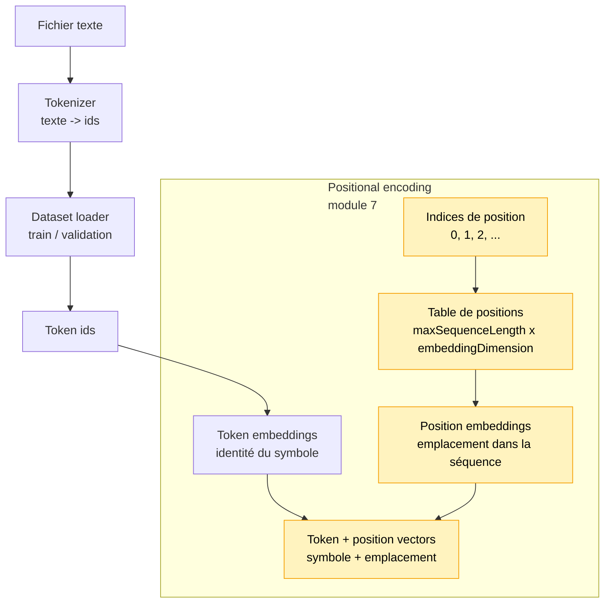

# Module 7 — Positional encoding CPU

Ce module ajoute une information de position aux embeddings. Jusqu'ici, le code connaissait
les indices des positions pour appliquer le masque causal, mais les vecteurs eux-mêmes ne
contenaient pas encore l'information "je suis en position 0, 1, 2, ...".

Il reste volontairement CPU-only: pas de TensorFlow.js, pas de tenseurs, pas de gradients et
pas encore d'entraînement.

## Pourquoi ce module existe

Un token embedding indique l'identité d'un symbole:

```text
embedding("l") = représentation du symbole "l"
```

Mais il ne dit pas où ce symbole apparaît dans la séquence. Dans `llm`, les deux `l` ont le
même token embedding. Sans information de position, leurs vecteurs de départ sont identiques.

Le positional encoding ajoute l'emplacement:

```text
représentation finale = tokenEmbedding + positionEmbedding
```

Donc:

```text
embedding("l") + embedding(position 0)
embedding("l") + embedding(position 1)
```

Les deux tokens restent le même symbole, mais ils ne sont plus au même endroit.

## Schéma progressif



Le module 7 ne remplace pas les token embeddings. Il ajoute une deuxième information: la
position du token dans la séquence.

## Concepts

- **Token embedding**: identité du symbole.
- **Position embedding**: emplacement dans la séquence.
- **Position index**: entier `0`, `1`, `2`, etc., utilisé pour choisir une ligne dans la table.
- **Vecteur combiné**: somme du token embedding et du position embedding.

Dans ce module, on utilise une table de positions "apprises mais non entraînées". Cela veut
dire que la table ressemble à un paramètre de modèle, mais ses valeurs restent celles de
l'initialisation déterministe.

On n'utilise pas encore de sinusoïdes. Les sinusoïdes sont une autre stratégie classique,
mais elles ajoutent une couche mathématique qui n'est pas nécessaire pour comprendre l'idée
principale: injecter la position dans les vecteurs.

## Différence avec le module 5

Le module 5 utilisait déjà les positions pour le masque causal:

```text
position 2 ne peut pas regarder la position 3
```

Mais cette information vivait dans le code de l'attention. Elle n'était pas dans les vecteurs.

Avec ce module, le vecteur lui-même contient une trace de sa position:

```text
vecteur = identité du token + emplacement dans la séquence
```

Le bloc Transformer du module 6 ne reçoit pas encore automatiquement ces vecteurs enrichis.
Dans ce module, on isole volontairement la brique "position". Dans un module suivant, le
pipeline donnera au modèle des vecteurs `token + position` au lieu de simples token embeddings.

## Exemple

```ts
import { addPositionalEmbeddings, createPositionEmbeddingTable } from './index.js'

const positionTable = createPositionEmbeddingTable({
    maxSequenceLength: 16,
    embeddingDimension: 4,
    seed: 123,
})

const tokenVectors = [
    [0.1, 0.2, 0.3, 0.4],
    [0.1, 0.2, 0.3, 0.4],
]

const positionedVectors = addPositionalEmbeddings(tokenVectors, positionTable)

console.info(positionedVectors)
```

Pour lancer une démo exécutable:

```bash
npm run demo:07-positional-encoding
```

La démo affiche d'abord un exemple avec `llm`, puis, dans un terminal interactif, elle permet
de saisir une ou plusieurs lettres du vocabulaire. Appuie sur `ENTRÉE` pour valider et sur
`ESC` pour quitter.

## Impact mémoire / VRAM

Tout est stocké en tableaux JavaScript CPU. La VRAM consommée est donc 0.

La mémoire augmente avec:

```text
maxSequenceLength x embeddingDimension
```

Le compromis est volontaire: une table de positions est simple à comprendre, mais elle impose
une longueur maximale de séquence. Dans la démo, `maxSequenceLength = 16`.

## Limites

- Les positions ne sont pas entraînées.
- Pas de positional encoding sinusoïdal.
- Longueur maximale fixée par `maxSequenceLength`.
- Pas encore de training loop.
- Pas de tenseurs GPU.
