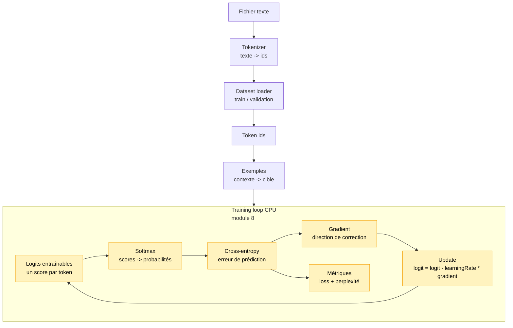

# Module 8 — Training loop CPU pédagogique

Ce module introduit la première boucle d'entraînement du projet. Jusqu'ici, les modules
créaient des représentations ou appliquaient des calculs, mais aucun paramètre n'était modifié
par apprentissage.

La **loss** est le score d'erreur que l'on cherche à faire baisser pendant l'entraînement.
Version développeur: c'est une fonction qui transforme "la prédiction du modèle + la bonne
réponse attendue" en un nombre. Plus ce nombre est bas, meilleure est la prédiction sur
l'exemple observé.

Ici, on apprend volontairement un modèle très simple: un vecteur de logits de biais. Il ne
regarde pas encore le contexte. Il apprend seulement quels tokens sont globalement fréquents.
C'est limité, mais cela rend visible la mécanique centrale:

```text
prédire -> calculer la loss -> calculer une correction -> mettre à jour -> recommencer
```

## Pourquoi ce module existe

Un LLM autoregressif apprend à prédire le prochain token:

```text
contexte: [token0, token1, token2]
cible:    token3
```

Pour entraîner un modèle, on transforme donc la séquence du dataset en petits exemples:

```text
[10, 11, 12, 13, 14]

contexte [10, 11] -> cible 12
contexte [11, 12] -> cible 13
contexte [12, 13] -> cible 14
```

Dans un vrai modèle de langage, le contexte influence la prédiction. Dans ce module, le modèle
l'ignore encore pour isoler la boucle d'entraînement elle-même.

## Schéma progressif



## Concepts

- **Exemple d'entraînement**: couple `contexte -> cible`.
- **Loss**: score d'erreur que l'entraînement cherche à réduire. Une loss basse signifie que
  le modèle donne une bonne probabilité à la bonne cible.
- **Logit**: score brut avant probabilité. Un logit peut être négatif, positif, petit ou grand.
- **Softmax**: fonction qui transforme des logits en probabilités dont la somme vaut `1`.
- **Cross-entropy**: loss élevée si le modèle donne peu de probabilité au bon token.
- **Gradient**: direction dans laquelle modifier les paramètres pour réduire l'erreur.
- **Learning rate**: taille du pas de correction.
- **Epoch**: passage complet sur les exemples d'entraînement.
- **Perplexité**: `exp(loss)`, une manière de lire la loss comme un niveau d'incertitude moyen.

## Pourquoi un modèle aussi simple ?

Le modèle de ce module contient seulement:

```text
logits[tokenId]
```

Il apprend donc une préférence globale:

```text
le token "e" apparaît souvent -> son logit monte
le token "z" apparaît rarement -> son logit reste bas
```

Il ne peut pas apprendre que `"l"` est souvent suivi de `"e"` ou que `"bo"` est souvent suivi de
`"n"`. Cela viendra avec un modèle de langage minimal plus complet.

Ce choix est pédagogique: avant d'entraîner un Transformer, on veut comprendre la boucle
d'entraînement dans une forme presque transparente.

## Formule utile

Pour une cross-entropy après softmax, le gradient du logit d'un token est:

```text
gradient = probabilité prédite - probabilité attendue
```

La probabilité attendue vaut `1` pour le bon token et `0` pour les autres. Ensuite:

```text
nouveau logit = ancien logit - learningRate * gradient
```

Version intuitive:

- mauvais token trop probable -> son logit baisse;
- bon token pas assez probable -> son logit monte;
- `learningRate` règle l'intensité de la correction.

## Exemple

```ts
import {
    createNextTokenExamples,
    createTrainableTokenBiasModel,
    trainNextTokenModel,
} from './index.js'

const tokenIds = [0, 1, 0, 1, 1]
const examples = createNextTokenExamples(tokenIds, { contextLength: 2 })
const model = createTrainableTokenBiasModel({ vocabularySize: 2 })

const history = trainNextTokenModel(model, examples, {
    epochs: 10,
    learningRate: 0.5,
})

console.info(history.finalLoss)
```

Pour lancer la démo:

```bash
npm run demo:08-training-loop
```

La démo affiche le corpus, quelques exemples `contexte -> cible`, la loss avant et pendant
l'entraînement, puis les tokens les plus probables après apprentissage. Elle n'est pas
interactive dans ce module, parce que le modèle ignore encore le contexte: demander un texte à
l'utilisateur donnerait l'impression que ce texte influence la prédiction, ce qui serait faux.

L'interaction deviendra intéressante dans un module suivant, quand le modèle apprendra vraiment
à utiliser le contexte pour prédire le prochain token.

## Impact mémoire / VRAM

Tout tourne sur CPU avec des tableaux JavaScript. La VRAM consommée est donc 0.

La RAM augmente principalement avec:

```text
nombreExemples x contextLength
vocabularySize
```

Le compromis est volontaire: on garde tous les exemples en mémoire pour rendre le code lisible.
Ce n'est pas adapté à un gros dataset, où il faudrait créer des batches à la demande.

## Limites

- Le modèle ignore le contexte.
- La démo reste donc linéaire: elle montre la boucle d'entraînement, pas encore une génération
  conditionnée par un contexte.
- Pas de Transformer entraîné.
- Pas d'embeddings entraînés.
- Pas de batching.
- Pas de validation loss séparée.
- Pas de TensorFlow.js, pas d'autograd, pas de GPU.
