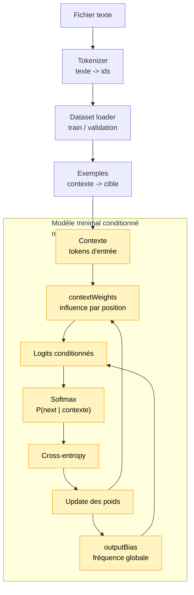

# Module 9 — Modèle de langage minimal entraînable CPU

Ce module crée le premier modèle du projet qui utilise réellement le contexte pour prédire le
prochain token.

Le module 8 apprenait une distribution globale:

```text
P(nextToken)
```

Le module 9 apprend une distribution conditionnée:

```text
P(nextToken | contexte)
```

Autrement dit, le modèle peut maintenant produire des probabilités différentes pour `"bonj"`,
`"le m"` ou `"chat"`.

## Pourquoi ce module existe

Un modèle de langage ne doit pas seulement savoir quels tokens sont fréquents. Il doit apprendre
que certains tokens deviennent probables après certains contextes:

```text
contexte "bonj" -> "o" devient probable
contexte "le m" -> "o" devient probable
contexte "chat" -> " " ou "." peuvent devenir probables selon le corpus
```

Ce module reste très loin d'un Transformer entraîné, mais il introduit une idée essentielle:
la prédiction dépend de l'entrée.

## Schéma progressif



## Concepts

- **Distribution globale**: probabilités apprises sans regarder le contexte.
- **Distribution conditionnée**: probabilités qui changent selon le contexte.
- **`outputBias`**: préférence générale pour chaque prochain token.
- **`contextWeights`**: poids qui disent comment un token du contexte influence un prochain token.
- **Position dans le contexte**: le même token peut avoir une influence différente selon son
  emplacement dans la fenêtre.
- **Logits conditionnés**: scores calculés à partir du biais global et du contexte.

La formule utilisée reste volontairement simple:

```text
logits[next] = outputBias[next] + moyenne des contributions du contexte
```

Puis on réutilise les briques du module 8:

```text
logits -> softmax -> cross-entropy -> gradient -> update
```

## Pourquoi ce n'est pas encore un vrai LLM

Le modèle apprend des associations directes entre tokens du contexte et prochain token. Il n'a
pas encore:

- d'embeddings entraînés;
- de self-attention entraînée;
- de bloc Transformer entraîné;
- de génération multi-token;
- d'autograd ou de TensorFlow.js.

Il est utile parce qu'il montre, sans magie, le passage de:

```text
quels tokens sont fréquents ?
```

à:

```text
quels tokens sont probables après ce contexte ?
```

## Exemple

```ts
import { createNextTokenExamples } from '../08-training-loop-cpu/index.js'
import {
    createMinimalLanguageModel,
    predictNextTokenProbabilities,
    trainMinimalLanguageModel,
} from './index.js'

const tokenIds = [0, 1, 2, 0, 1, 3]
const examples = createNextTokenExamples(tokenIds, { contextLength: 2 })
const model = createMinimalLanguageModel({
    contextLength: 2,
    vocabularySize: 4,
})

trainMinimalLanguageModel(model, examples, {
    epochs: 20,
    learningRate: 0.3,
})

const probabilities = predictNextTokenProbabilities(model, [0, 1])
console.info(probabilities)
```

Pour lancer la démo:

```bash
npm run demo:09-minimal-lm
```

La démo compare le modèle global du module 8 avec le modèle conditionné du module 9, puis
affiche une prédiction pour un contexte fixe. Elle indique aussi le pourcentage d'amélioration
de loss pour rendre le progrès plus lisible.

Contrairement au module 8, le mode interactif a du sens ici: le modèle utilise réellement le
contexte. La démo permet donc de saisir un contexte de `4` caractères et d'observer comment les
probabilités du prochain token changent.

## Impact mémoire / VRAM

Tout tourne en CPU avec des tableaux JavaScript. La VRAM consommée est donc 0.

Le coût mémoire principal est:

```text
contextLength x vocabularySize x vocabularySize
```

Ce choix est acceptable ici parce que le tokenizer caractère donne un vocabulaire minuscule.
Il ne serait pas raisonnable tel quel avec un grand vocabulaire moderne.

## Limites

- CPU uniquement.
- Pas de génération complète.
- Pas de Transformer entraîné.
- Pas d'embeddings entraînés.
- Pas de batching.
- Pas de validation loss séparée.
- Mémoire quadratique en `vocabularySize`.
