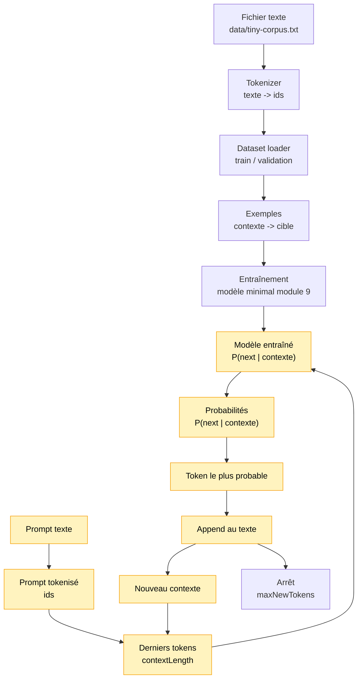

# Module 10 — Text generation greedy CPU

Ce module transforme la prédiction d'un prochain token en génération de texte. Le module 9
savait répondre à une question locale:

```text
quel est le prochain token le plus probable après ce contexte ?
```

Le module 10 répète cette question plusieurs fois:

```text
contexte -> prochain token -> nouveau contexte -> prochain token -> ...
```

## Pourquoi ce module existe

Un LLM autorégressif génère du texte en ajoutant un token à la fois. Il ne produit pas toute la
phrase en une seule opération. Chaque token généré devient une partie du contexte pour prédire
le token suivant.

Dans ce module, la génération est volontairement déterministe:

```text
prochain token = token avec la plus grande probabilité
```

C'est ce qu'on appelle le **greedy decoding**.

## Schéma progressif



## Concepts

- **Prompt**: texte de départ fourni par l'utilisateur.
- **Contexte de génération**: derniers `contextLength` tokens utilisés pour prédire la suite.
- **Greedy decoding**: choix systématique du token le plus probable.
- **Boucle autorégressive**: le token généré est ajouté à la séquence, puis réutilisé pour la
  prédiction suivante.
- **`maxNewTokens`**: nombre maximal de tokens ajoutés, nécessaire ici car il n'existe pas encore
  de token spécial de fin.

## Exemple

```ts
import { generateText } from './index.js'

const result = generateText(model, tokenizer, 'bonj', {
    maxNewTokens: 20,
})

console.info(result.text)
console.info(result.steps)
```

Pour lancer la démo:

```bash
npm run demo:10-text-generation
```

La démo entraîne d'abord le modèle minimal du module 9, puis génère du texte avec un prompt
fixe. Elle affiche chaque étape: contexte utilisé, token prédit et texte partiel.

Dans un terminal interactif, elle permet aussi de saisir un prompt. Le prompt doit contenir au
moins `contextLength` caractères connus du tokenizer.

## Impact mémoire / VRAM

Tout tourne sur CPU avec des tableaux JavaScript. La VRAM consommée est donc 0.

La mémoire augmente surtout avec:

```text
longueur du prompt + maxNewTokens + nombre d'étapes tracées
```

Comme on garde l'historique des étapes pour l'apprentissage, ce module privilégie la lisibilité
plutôt que la mémoire minimale.

## Limites

- Greedy decoding uniquement.
- Sortie déterministe.
- Peut devenir répétitif.
- Pas de température.
- Pas de top-k, top-p ou sampling aléatoire.
- Pas de token `<eos>`.
- Arrêt uniquement avec `maxNewTokens`.
- Qualité fortement dépendante du mini corpus et du modèle très simple du module 9.
