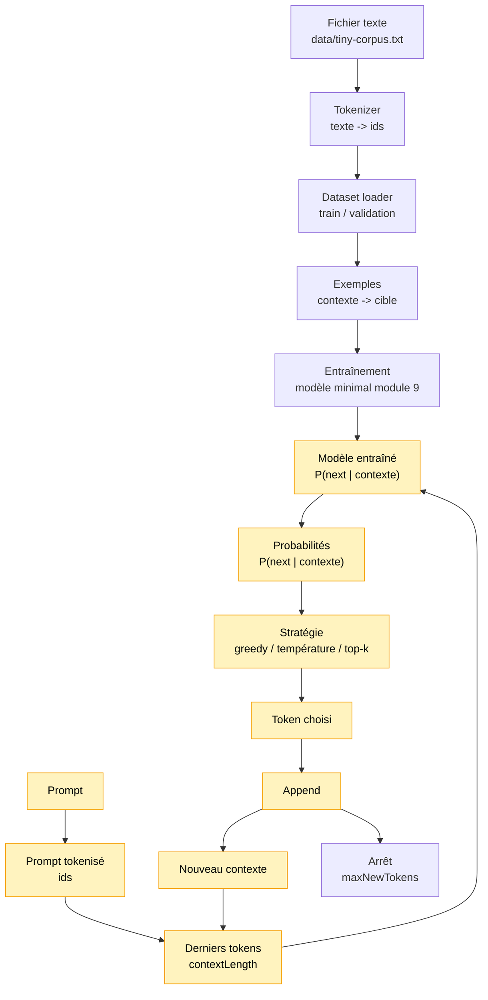

# Module 11 — Sampling strategies CPU

Ce module change la manière de choisir le prochain token pendant la génération.

Le module 10 utilisait le **greedy decoding**:

```text
prendre toujours le token le plus probable
```

Le module 11 introduit le **sampling**:

```text
tirer un token selon une distribution de probabilités
```

Le modèle entraîné ne change pas. On change seulement la stratégie de sélection à chaque étape
de génération.

## Pourquoi ce module existe

Greedy est simple et stable, mais il peut devenir très répétitif. Le sampling accepte un peu
d'incertitude contrôlée: on peut choisir parfois un token moins probable, ce qui rend la sortie
plus variée.

Dans un vrai LLM, les stratégies de sampling ont un impact énorme sur le style de sortie:

- plus stable;
- plus créatif;
- plus risqué;
- plus répétitif;
- plus ou moins fidèle aux probabilités du modèle.

## Schéma progressif



## Concepts

- **Greedy**: choisit toujours le token le plus probable. Déterministe, stable, souvent répétitif.
- **Sampling**: tire un token selon une distribution. Plus variable, moins prévisible.
- **Température**: transforme la distribution avant le tirage.
- **Top-k**: garde seulement les `k` tokens les plus probables, puis tire parmi eux.
- **Seed**: rend les tirages reproductibles.

### Température

```text
température basse -> distribution plus pointue -> moins de variété
température haute -> distribution plus plate -> plus de variété
```

`temperature = 1` laisse la distribution inchangée.

### Top-k

```text
on garde les k candidats les plus probables
on met les autres à 0
on renormalise
on tire parmi les candidats restants
```

Dans ce module, top-k peut aussi recevoir une température. La température est appliquée avant
le filtrage top-k.

## Exemple

```ts
import { generateTextWithSampling } from './index.js'

const result = generateTextWithSampling(model, tokenizer, 'bonj', {
    maxNewTokens: 40,
    seed: 123,
    strategy: 'topK',
    temperature: 1,
    topK: 3,
})

console.info(result.text)
```

Pour lancer la démo:

```bash
npm run demo:11-sampling
```

La démo entraîne le modèle minimal du module 9, puis compare quatre sorties:

- greedy;
- température basse;
- température haute;
- top-k.

Elle propose aussi un mode interactif pour tester un prompt avec toutes les stratégies.

Note importante: les sorties restent volontairement limitées. Le corpus est minuscule et le
modèle du module 9 reste très simple: il apprend des associations locales entre caractères,
pas une compréhension générale de la langue. Un corpus plus long pourrait donner un peu plus
de variété, mais la vraie amélioration viendra surtout avec un modèle plus expressif et un
entraînement plus réaliste.

## Impact mémoire / VRAM

Tout tourne en CPU avec des tableaux JavaScript. La VRAM consommée est donc 0.

La mémoire supplémentaire est proportionnelle à la taille du vocabulaire, car on transforme les
probabilités à chaque étape:

```text
vocabularySize
```

## Limites

- Pas de top-p dans ce module.
- Pas de token `<eos>`.
- Arrêt uniquement via `maxNewTokens`.
- Le sampling peut produire des sorties moins cohérentes.
- Les résultats dépendent fortement du mini corpus et du modèle très simple du module 9.
