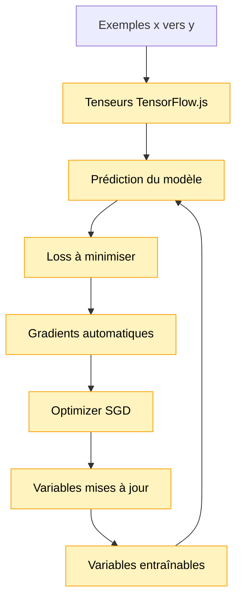

# Module 12 — TensorFlow.js / Autograd

Ce module introduit TensorFlow.js avec un exemple volontairement très simple:

```text
y = weight * x + bias
```

Ce n'est pas encore un modèle de langage. C'est une loupe sur le mécanisme qui rendra les
modules suivants plus réalistes: entraîner des paramètres avec des gradients calculés
automatiquement.

## Pourquoi cet exemple existe

Le problème `y = 2x + 1` n'est pas intéressant en lui-même. Son intérêt est pédagogique:

```text
variables -> prédiction -> loss -> gradients -> update
```

Avec les modules précédents, nous écrivions les tableaux et les corrections à la main. Avec
TensorFlow.js, on manipule des tenseurs, on définit des variables entraînables, puis l'autograd
calcule les gradients pour nous.

Si on mélangeait tout de suite TensorFlow.js avec vocabulaire, embeddings, logits, softmax,
cross-entropy et génération, le module deviendrait trop dense. Ici, on isole seulement la
mécanique d'entraînement.

## Schéma progressif



## Concepts

- **`tf.Tensor`**: conteneur de nombres avec une shape. Par exemple, `tf.tensor1d([0, 1, 2])`
  contient trois valeurs sur un axe.
- **Shape**: dimensions du tenseur. Une liste de quatre nombres a une shape `[4]`.
- **`tf.Variable`**: tenseur modifiable par entraînement. Ici, `weight` et `bias` sont des
  variables.
- **Prédiction**: résultat produit par le modèle.
- **Loss**: score d'erreur que l'on cherche à minimiser.
- **Autograd**: calcul automatique des gradients. TensorFlow.js retrouve comment chaque variable
  influence la loss.
- **Optimizer**: objet qui applique les corrections aux variables. Ce module utilise SGD.
- **SGD**: abréviation de _stochastic gradient descent_. Dans ce module, on peut le lire comme
  une descente de gradient simple: regarder la pente indiquée par les gradients, puis déplacer un
  peu les variables dans la direction qui réduit la loss.
- **Learning rate**: taille du pas de correction.
- **`tf.tidy` / `dispose`**: outils de gestion mémoire pour éviter d'accumuler des tenseurs
  inutiles.

## La loss utilisée

On utilise la mean squared error:

```text
loss = moyenne((prédiction - cible)²)
```

Version développeur:

- si la prédiction est égale à la cible, la loss vaut `0`;
- si la prédiction est trop haute ou trop basse, l'erreur est mise au carré;
- l'optimizer cherche des valeurs de `weight` et `bias` qui réduisent cette loss.

## Progression vers un mini LLM

```text
Module 12: entraîner une mini formule pour comprendre autograd
Module 13: appliquer autograd à une prédiction next-token
Module 14: appliquer autograd à un mini Transformer
```

Ce module ne remplace donc pas les modules précédents. Il ajoute l'outil qui permettra de ne
plus écrire tous les gradients à la main.

## Exemple

```ts
import {
    createScalarRegressionModel,
    disposeScalarRegressionModel,
    trainScalarRegressionModel,
} from './index.js'

const model = createScalarRegressionModel()

const history = trainScalarRegressionModel(
    model,
    [
        { input: 0, target: 1 },
        { input: 1, target: 3 },
        { input: 2, target: 5 },
        { input: 3, target: 7 },
    ],
    {
        epochs: 80,
        learningRate: 0.05,
    },
)

console.info(history.finalLoss)
disposeScalarRegressionModel(model)
```

Pour lancer la démo:

```bash
npm run demo:12-tfjs-autograd
```

La démo affiche les valeurs initiales de `weight` et `bias`, la loss pendant l'entraînement,
puis les valeurs apprises.

TensorFlow.js peut afficher en fin d'exécution un message suggérant `tfjs-node`. C'est normal
en environnement Node.js. Ce module reste volontairement sur `@tensorflow/tfjs` pour éviter une
dépendance native plus lourde pendant cette introduction.

## Impact mémoire / VRAM

Ce module utilise `@tensorflow/tfjs`, sans `@tensorflow/tfjs-node`. Les tenseurs sont minuscules
et le but n'est pas la performance.

Même avec de petits tenseurs, TensorFlow.js alloue des buffers internes. C'est pour cela que le
module montre deux réflexes importants:

- `tf.tidy` pour libérer les tenseurs intermédiaires;
- `dispose` pour libérer explicitement les variables du modèle.

Sur ce module, l'impact mémoire est négligeable. La VRAM dépend du backend réellement utilisé par
TensorFlow.js, mais aucun calcul lourd ni grand tenseur n'est créé.

## Limites

- Pas de langage naturel.
- Pas de tokenizer.
- Pas de logits de vocabulaire.
- Pas de cross-entropy.
- Pas de génération.
- Pas de Transformer entraînable.
- Exemple volontairement trop simple pour être utile hors pédagogie.
