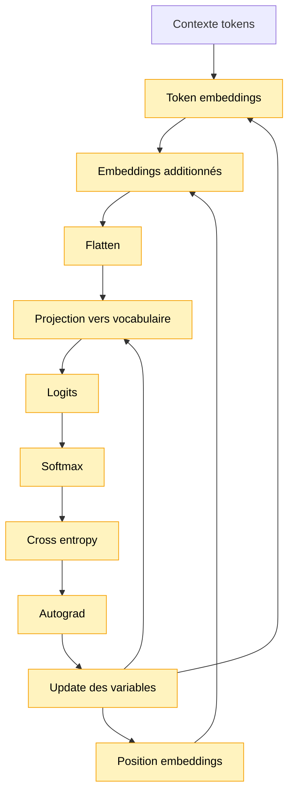

# Module 13 — Modèle next-token TensorFlow.js

Ce module crée le premier modèle de langage neuronal entraînable du projet. Il reçoit un contexte
de tokens et apprend à prédire le prochain token avec TensorFlow.js.

Il ne contient pas encore de Transformer. Son rôle est de faire le pont entre:

```text
Module 12: autograd sur une formule simple
Module 13: autograd sur des tokens
Module 14: autograd sur un mini Transformer
```

## Pourquoi ce module existe

Le module 9 apprenait déjà `P(nextToken | contexte)`, mais avec des tableaux JavaScript et des
gradients écrits à la main.

Ici, les paramètres deviennent des `tf.Variable`:

- embeddings de tokens;
- embeddings de positions;
- matrice de sortie;
- biais de sortie.

TensorFlow.js calcule automatiquement les gradients et l'optimizer met à jour ces variables.

## Schéma progressif



## Shapes

Avec les paramètres de démo:

```text
contextLength = 4
embeddingDimension = 8
```

Les shapes principales sont:

```text
contexte tokenisé      [4]
tokenEmbeddings       [vocabularySize, 8]
positionEmbeddings    [4, 8]
embeddings du contexte [4, 8]
contexte aplati        [32]
logits                [vocabularySize]
```

Version développeur:

- chaque token id sert d'index dans `tokenEmbeddings`;
- chaque position sert d'index dans `positionEmbeddings`;
- on additionne les deux pour obtenir “quel symbole, à quel endroit”;
- on aplatit la fenêtre de contexte;
- une projection finale donne un score brut pour chaque prochain token possible.

### Pourquoi `embeddingDimension = 8`

`embeddingDimension` est le nombre de nombres utilisés pour représenter un token.

Avec `embeddingDimension = 8`, chaque caractère reçoit donc un petit vecteur de 8 valeurs
entraînables. Ce n'est pas “8 dimensions réelles du langage” que l'on aurait choisies à la main:
ce sont 8 emplacements numériques que le modèle peut ajuster pour rendre certaines prédictions
plus faciles.

Le compromis est simple:

- dimension plus petite: moins de paramètres, plus lisible, mais moins de capacité;
- dimension plus grande: plus de capacité, mais plus de mémoire et plus de calcul.

On choisit `8` ici parce que le corpus et le vocabulaire sont minuscules. C'est assez grand pour
voir une vraie table d'embeddings entraînable, mais assez petit pour garder les shapes lisibles:

```text
contextLength x embeddingDimension = 4 x 8 = 32
```

## Concepts

- **Embedding entraînable**: vecteur que TensorFlow.js peut modifier pendant l'entraînement.
- **Position embedding entraînable**: vecteur qui indique au modèle où se trouve un token dans la
  fenêtre.
- **Logits de vocabulaire**: scores bruts, un par token possible.
- **Softmax**: transforme les logits en probabilités.
- **Cross-entropy sparse**: loss adaptée quand la cible est un id de classe, ici l'id du prochain
  token.
- **Autograd**: TensorFlow.js calcule les gradients au lieu de nous demander de les écrire à la
  main.
- **Adam**: optimizer plus adaptatif que la descente de gradient simple. Il ajuste les corrections
  à partir de l'historique récent des gradients, ce qui rend l'apprentissage plus lisible sur ce
  petit modèle à embeddings.
- **`tf.tidy` et `dispose`**: évitent de garder en mémoire des tenseurs inutiles.

## Différence avec un vrai Transformer

Ce modèle utilise le contexte, mais il n'a pas encore d'attention. Une fois les embeddings aplatis,
le modèle applique une projection directe vers le vocabulaire.

Il peut donc apprendre des motifs locaux du mini corpus, mais il ne sait pas encore faire la
communication structurée entre positions que l'on attend d'un Transformer.

## Cap vers la fin du projet

Ce module reste volontairement tiny. Le dernier module visera une pipeline plus réaliste sur un
texte plus long, avec une cible indicative:

```text
Dataset  5-20 MB
Params   1M-10M
Context  128
Layers   2-4
```

Ce module prépare ce cap en introduisant les premières variables TensorFlow.js liées au langage.

## Exemple

```ts
import { createNextTokenExamples } from '../08-training-loop-cpu/index.js'
import {
    createTfjsNextTokenModel,
    disposeTfjsNextTokenModel,
    trainTfjsNextTokenModel,
} from './index.js'

const examples = createNextTokenExamples(tokenIds, { contextLength: 4 })
const model = createTfjsNextTokenModel({
    contextLength: 4,
    embeddingDimension: 8,
    vocabularySize,
})

const history = trainTfjsNextTokenModel(model, examples, {
    epochs: 40,
    learningRate: 0.1,
})

console.info(history.finalLoss)
disposeTfjsNextTokenModel(model)
```

Pour lancer la démo:

```bash
npm run demo:13-tfjs-next-token
```

La démo affiche le corpus, les shapes, quelques exemples `contexte -> cible`, la loss avant et
après entraînement, puis les prédictions pour un contexte fixe.

TensorFlow.js peut afficher un message suggérant `tfjs-node`. C'est normal avec `@tensorflow/tfjs`
en Node.js. Ce module garde volontairement cette dépendance simple pour éviter un backend natif
plus lourd.

## Impact mémoire / VRAM

Tout reste minuscule dans ce module. Le coût mémoire principal vient des variables:

```text
tokenEmbeddings    vocabularySize x embeddingDimension
positionEmbeddings contextLength x embeddingDimension
outputWeights      contextLength x embeddingDimension x vocabularySize
outputBias         vocabularySize
```

Avec un tokenizer caractère et un petit corpus, c'est négligeable. Sur un vrai modèle, ces mêmes
dimensions deviennent centrales pour maîtriser la RAM, la VRAM et le temps d'entraînement.

## Limites

- Pas de self-attention entraînée.
- Pas de bloc Transformer entraînable.
- Pas de génération de texte complète dans ce module.
- Pas de batching configurable.
- Pas de sauvegarde ou chargement du modèle.
- Qualité limitée par le mini corpus et par l'architecture très simple.
