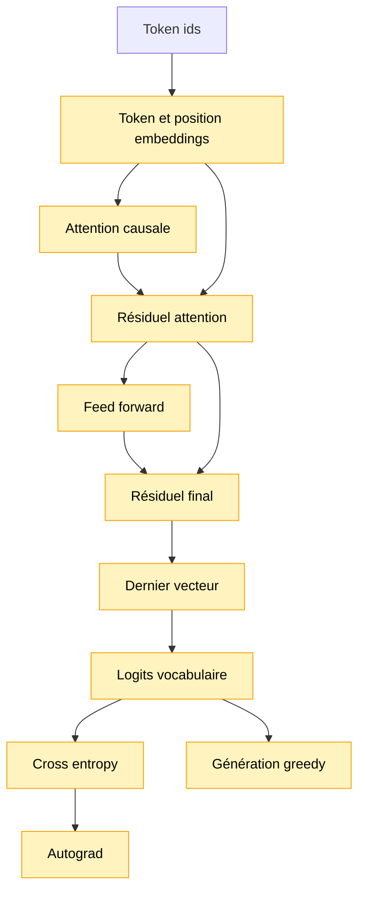

# Module 14 — Mini Transformer entraînable + génération greedy

Ce module crée le premier mini Transformer entraînable du projet avec TensorFlow.js, puis
l'utilise directement pour générer du texte.

Il réunit les briques vues séparément:

```text
embeddings + positions + self-attention causale + feed-forward + autograd + génération
```

## Pourquoi ce module existe

Le module 13 apprenait déjà à prédire le prochain token avec TensorFlow.js, mais le contexte était
aplati puis projeté directement vers le vocabulaire.

Ici, les positions communiquent d'abord entre elles avec une self-attention causale. C'est la
différence clé: avant de prédire, chaque position peut mélanger l'information des positions
précédentes.

## Schéma progressif



## Concepts

- **Q, query**: ce que la position cherche dans les autres positions.
- **K, key**: ce que chaque position annonce comme information disponible.
- **V, value**: l'information réellement mélangée quand une position regarde une autre position.
- **Masque causal**: empêche une position de regarder les positions futures.
- **Résiduel**: garde l'ancienne version du vecteur et ajoute une correction.
- **Feed-forward**: transforme chaque position séparément après l'attention.
- **Dernier vecteur**: représentation contextualisée de la dernière position du contexte.
- **Greedy decoding**: génération où l'on choisit toujours le token le plus probable.

## Shapes

Avec les paramètres de démo:

```text
contextLength = 4
embeddingDimension = 8
feedForwardDimension = 16
```

Les shapes principales sont:

```text
tokenEmbeddings         [vocabularySize, 8]
positionEmbeddings      [4, 8]
Q / K / V               [4, 8]
scores attention        [4, 4]
feed-forward            8 -> 16 -> 8
dernier vecteur         [8]
logits                  [vocabularySize]
```

Le coût de l'attention dépend surtout de:

```text
contextLength x contextLength
```

Ici, `4 x 4` reste minuscule. Avec un contexte `128`, ce coût devient déjà beaucoup plus visible.

## Génération

Après entraînement, le module peut générer du texte en boucle:

```text
prompt -> derniers tokens -> prédiction -> append -> nouveaux derniers tokens -> ...
```

La génération reste greedy:

```text
prochain token = token avec la probabilité la plus élevée
```

On ne réintroduit pas encore température, top-k ou sampling: le but est de voir un mini
Transformer entraînable produire du texte, pas de comparer les stratégies de décodage.

## Exemple

```ts
import { createNextTokenExamples } from '../08-training-loop-cpu/index.js'
import {
    createTrainableMiniTransformer,
    disposeTrainableMiniTransformer,
    generateMiniTransformerText,
    trainMiniTransformer,
} from './index.js'

const examples = createNextTokenExamples(tokenIds, { contextLength: 4 })
const model = createTrainableMiniTransformer({
    contextLength: 4,
    embeddingDimension: 8,
    feedForwardDimension: 16,
    vocabularySize,
})

trainMiniTransformer(model, examples, {
    epochs: 40,
    learningRate: 0.03,
})

const result = generateMiniTransformerText(model, tokenizer, 'bonj', {
    maxNewTokens: 40,
})

console.info(result.text)
disposeTrainableMiniTransformer(model)
```

Pour lancer la démo:

```bash
npm run demo:14-mini-transformer
```

La démo affiche le corpus, les shapes, les métriques d'entraînement, les prédictions avant/après,
puis une génération greedy.

## Impact mémoire / VRAM

Ce module utilise toujours `@tensorflow/tfjs`, sans `@tensorflow/tfjs-node`. Les tenseurs restent
très petits et le but reste pédagogique.

Les coûts importants sont:

```text
attention              contextLength x contextLength
embeddings             vocabularySize x embeddingDimension
feed-forward           embeddingDimension x feedForwardDimension
projection vocabulaire embeddingDimension x vocabularySize
```

Dans un vrai modèle, ces dimensions contrôlent directement la RAM, la VRAM et le temps
d'entraînement. `tf.tidy` et `dispose` restent indispensables pour ne pas accumuler de tenseurs
temporaires.

## Limites

- Une seule couche Transformer.
- Une seule tête d'attention.
- Pas de LayerNorm entraînable.
- Pas de dropout.
- Pas de sampling avancé.
- Pas de sauvegarde ou chargement de modèle.
- Pas encore de pipeline long corpus.
- Qualité limitée par le mini corpus et par les dimensions minuscules.
