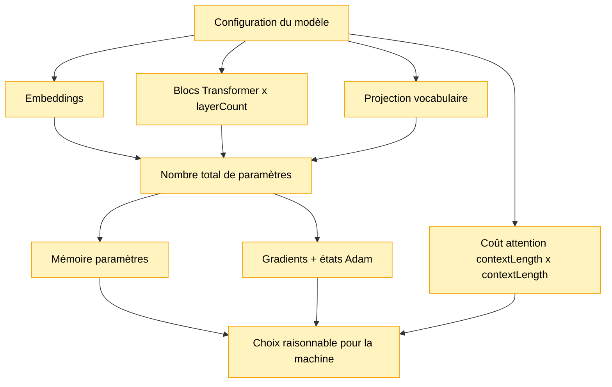

# Module 15 — Estimation mémoire et taille de modèle

Ce module estime la taille d’un mini Transformer avant de l’entraîner. Il ne lance pas
TensorFlow.js et ne mesure pas la mémoire réelle: il calcule des ordres de grandeur à partir des
shapes.

L’objectif est de relier des paramètres comme `contextLength`, `embeddingDimension` et
`layerCount` à des conséquences concrètes en RAM, VRAM et temps de calcul.

## Pourquoi ce module existe

Jusqu’ici, les modèles étaient volontairement minuscules. Avant de passer à `@tensorflow/tfjs-node`,
à un corpus plus long et à un modèle plus sérieux, il faut comprendre ce qui grossit.

Un modèle peut avoir l’air simple dans le code:

```text
embeddings -> attention -> feed-forward -> logits
```

Mais derrière, chaque flèche contient des matrices. Ces matrices contiennent des paramètres. Ces
paramètres prennent de la mémoire, et l’entraînement ajoute encore des buffers supplémentaires.

## Schéma progressif



## Concepts

- **Paramètre**: nombre entraînable du modèle. Par exemple, une case dans une matrice
  d’embeddings ou dans une projection d’attention.
- **`float32`**: format numérique courant. Un nombre `float32` prend environ `4 bytes`.
- **Mémoire des paramètres**: mémoire minimale nécessaire pour stocker les poids du modèle.
- **Gradient**: correction calculée pendant l’entraînement pour chaque paramètre.
- **Adam**: optimizer qui garde deux états supplémentaires par paramètre. Il est pratique, mais il
  augmente la mémoire d’entraînement.
- **Activation**: valeur intermédiaire produite pendant le forward pass. Pendant l’entraînement,
  certaines activations doivent rester disponibles pour calculer les gradients.
- **Coût attention**: la self-attention compare les positions entre elles, donc le nombre de scores
  grandit comme:

```text
contextLength x contextLength
```

Passer de `128` à `256` ne double pas ce coût: cela le multiplie par environ `4`.

## Formules utilisées

Pour une configuration proche du module 14:

```text
tokenEmbeddings    = vocabularySize x embeddingDimension
positionEmbeddings = contextLength x embeddingDimension
attention/layer    = 4 x embeddingDimension x embeddingDimension
feedForward/layer  = embeddingDimension x feedForwardDimension
                   + feedForwardDimension
                   + feedForwardDimension x embeddingDimension
                   + embeddingDimension
outputProjection   = embeddingDimension x vocabularySize + vocabularySize
```

Le facteur `4` dans l’attention correspond aux matrices:

```text
Q, K, V, projection de sortie
```

L’estimation mémoire principale est:

```text
parameterBytes = totalParameters x bytesPerParameter
```

Pour l’entraînement avec Adam, on estime:

```text
trainingParameterBytes =
    paramètres
  + gradients
  + états Adam m/v
```

Ce n’est pas toute la mémoire réelle, mais c’est déjà une base très utile.

## Exemple

```ts
import { estimateMiniTransformerSize, formatBytes, formatParameterCount } from './index.js'

const estimate = estimateMiniTransformerSize({
    vocabularySize: 512,
    contextLength: 128,
    embeddingDimension: 384,
    feedForwardDimension: 1536,
    layerCount: 4,
    batchSize: 4,
})

console.info(formatParameterCount(estimate.parameters.total))
console.info(formatBytes(estimate.memory.trainingParameterBytes))
```

Pour lancer la démo:

```bash
npm run demo:15-model-sizing
```

La démo compare le modèle tiny du module 14, un modèle pédagogique plus grand et une cible
indicative proche de la fin du projet.

## Lien avec l’objectif final

La cible indicative du projet reste:

```text
Dataset  5-20 MB
Params   1M-10M
Context  128
Layers   2-4
```

Ce module sert à vérifier que ces nombres restent cohérents avec une machine modeste avant
d’écrire une pipeline plus lourde.

## Impact mémoire / VRAM

Ce module est CPU pur et n’alloue aucun tenseur TensorFlow.js. Il utilise seulement des nombres
JavaScript.

Il aide quand même à raisonner sur la VRAM future:

- plus de paramètres signifie plus de mémoire modèle;
- Adam augmente fortement la mémoire pendant l’entraînement;
- les scores d’attention grandissent au carré avec le contexte;
- un batch plus grand multiplie les activations et les scores intermédiaires.

## Limites

- Ce n’est pas un profiler réel.
- Les buffers internes de TensorFlow.js ne sont pas mesurés.
- Les activations sont seulement estimées grossièrement.
- Le backend réel, CPU ou GPU, peut changer l’empreinte mémoire.
- Les optimisations futures, comme mixed precision ou gradient accumulation, ne sont pas encore
  modélisées.
