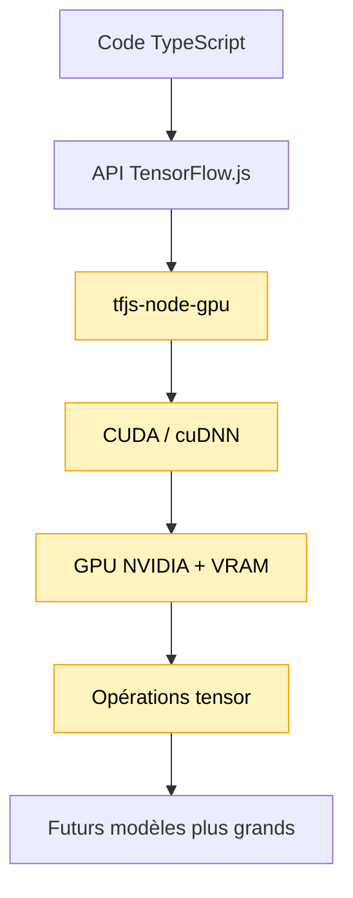

# Module 16 — Backend GPU TensorFlow.js sous WSL2, Linux et macOS

Ce module prépare le projet à utiliser `@tensorflow/tfjs-node-gpu` quand un environnement CUDA
compatible est disponible.

Il ne lance pas encore d’entraînement long corpus. Son rôle est de vérifier le moteur d’exécution:

```text
TypeScript -> TensorFlow.js -> tfjs-node-gpu -> CUDA/cuDNN -> GPU NVIDIA
```

## Pourquoi ce module existe

Les modules 12 à 14 utilisent `@tensorflow/tfjs`. C’est très pratique pour apprendre, mais ce
backend reste du JavaScript côté CPU. Pour viser un objectif plus ambitieux:

```text
Dataset  5-20 MB
Params   1M-10M
Context  128
Layers   2-4
```

il faut préparer un backend plus adapté. Avec un GPU NVIDIA compatible CUDA, le chemin cohérent
est le backend GPU TensorFlow.js Node, c’est-à-dire `@tensorflow/tfjs-node-gpu`.

## Schéma progressif



## Concepts

- **Backend TensorFlow.js**: moteur qui exécute les opérations tensor. Ce n’est pas un modèle.
- **`@tensorflow/tfjs`**: backend pur JavaScript, simple et portable, mais lent.
- **`@tensorflow/tfjs-node`**: backend natif CPU via le binaire TensorFlow C.
- **`@tensorflow/tfjs-node-gpu`**: backend natif GPU via TensorFlow C, CUDA et cuDNN.
- **CUDA**: plateforme NVIDIA qui permet d’exécuter du calcul général sur GPU.
- **cuDNN**: bibliothèque NVIDIA optimisée pour les opérations de deep learning.
- **VRAM**: mémoire de la carte graphique. C’est elle que l’on veut utiliser pour entraîner des
  modèles plus confortablement.
- **Smoke test**: petit calcul connu pour vérifier que le backend fonctionne.
- **Benchmark indicatif**: mesure grossière pour observer un ordre de grandeur, pas une preuve de
  performance réelle.

## Compatibilité par système

## Installation optionnelle du backend GPU

`@tensorflow/tfjs-node-gpu` n’est pas une dépendance installée par défaut dans ce projet. C’est
volontaire: ce package dépend de CUDA, de bibliothèques natives Linux et d’un environnement GPU
compatible. L’imposer dans `package.json` casserait l’installation pour beaucoup de personnes.

Pour tester ce module dans WSL ou Linux, installe le backend GPU localement:

```bash
npm run gpu:install
```

Le script exécute `npm install @tensorflow/tfjs-node-gpu@4.22.0 --no-save`. L’option `--no-save`
évite d’ajouter cette dépendance au `package.json`. Le module charge le package dynamiquement: s’il
n’est pas installé, la démo affiche un diagnostic pédagogique au lieu de faire échouer tout le
projet.

Si `node_modules` est nettoyé, supprimé ou réinstallé depuis Windows, cette installation locale peut
disparaître. Dans ce cas, relance simplement `npm run gpu:install` depuis WSL/Linux.

### Note sécurité sur `npm audit`

`npm audit` peut signaler des vulnérabilités transitives via `tar` et `@mapbox/node-pre-gyp`, qui
sont utilisés par `@tensorflow/tfjs-node-gpu` pour installer les bindings natifs.

Ne lance pas:

```bash
npm audit fix --force
```

Dans ce cas précis, npm peut proposer un downgrade majeur vers une ancienne version incompatible de
`@tensorflow/tfjs-node-gpu`. Pour ce projet pédagogique local, on accepte temporairement ce risque
uniquement dans l’environnement GPU de test. Cette configuration ne doit pas être traitée comme
production-ready.

### Windows + WSL2 + NVIDIA

Sur Windows, le backend GPU TensorFlow.js Node doit être utilisé via WSL2, car il repose sur CUDA
et vise Linux.

Côté Windows:

```bash
nvidia-smi
```

Côté WSL Ubuntu:

```bash
nvidia-smi
node -v
npm -v
```

Recommandations:

- utiliser Node 20 LTS dans WSL pour les bindings natifs;
- installer les outils de build:

```bash
sudo apt update
sudo apt install -y build-essential python3 make g++
```

- installer CUDA/cuDNN selon la documentation NVIDIA CUDA on WSL;
- ne pas installer un driver NVIDIA Linux complet dans WSL: le driver reste côté Windows.

Attention: les dépendances natives installées sous WSL produisent des binaires Linux dans
`node_modules`. Si tu relances ensuite la démo depuis PowerShell Windows avec ce même
`node_modules`, tu peux voir une erreur du type:

```text
tfjs_binding.node is not a valid Win32 application
```

Ce n’est pas une erreur GPU: cela signifie simplement que le binaire natif a été installé pour
Linux/WSL et qu’il est exécuté depuis Windows. Pour le module GPU, lance les commandes depuis WSL.
Si tu veux repasser à Windows pour les modules non GPU, il peut être nécessaire de réinstaller
`node_modules` côté Windows.

### Linux natif + NVIDIA

Sur Linux natif, le chemin est plus direct:

```bash
nvidia-smi
node -v
npm -v
```

Pré-requis:

- driver NVIDIA installé;
- CUDA installé;
- cuDNN installé;
- Node 20 LTS recommandé;
- outils de build installés.

Ensuite:

```bash
npm install @tensorflow/tfjs-node-gpu
```

### macOS

Sur macOS, `@tensorflow/tfjs-node-gpu` n’est pas le bon choix. Ce package repose sur CUDA, donc sur
un GPU NVIDIA dans un environnement Linux compatible.

Pour macOS:

- continuer avec `@tensorflow/tfjs` pur JS pour l’apprentissage;
- tester éventuellement `@tensorflow/tfjs-node` CPU natif;
- ne pas attendre d’utilisation de la VRAM/GPU via `tfjs-node-gpu`.

## API

Le module expose:

- `getRuntimeEnvironmentInfo()` pour afficher OS, Node, architecture et backend actuel;
- `loadTfjsNodeGpuBackend()` pour charger dynamiquement `@tensorflow/tfjs-node-gpu`;
- `runTfjsNodeGpuSmokeTest()` pour vérifier une multiplication matricielle connue;
- `benchmarkTfjsNodeGpuMatMul()` pour lancer un micro-benchmark indicatif.

Le chargement est dynamique pour que le projet reste utilisable même si le package GPU n’est pas
encore installé dans l’environnement courant.

## Exemple

```ts
import { loadTfjsNodeGpuBackend, runTfjsNodeGpuSmokeTest } from './index.js'

const backend = await loadTfjsNodeGpuBackend()

if (!backend.available) {
    console.info(backend.errorMessage)
    console.info(backend.guidance)
} else {
    console.info(backend.backendName)
    console.info(await runTfjsNodeGpuSmokeTest())
}
```

Pour lancer la démo:

```bash
npm run gpu:demo
```

Si `@tensorflow/tfjs-node-gpu` n’est pas installé ou ne charge pas, la démo affiche un diagnostic
pédagogique et se termine proprement.

### Lire les logs TensorFlow natifs

Au moment où `@tensorflow/tfjs-node-gpu` se charge, TensorFlow peut afficher des logs directement
dans le terminal, avant même que la démo reprenne la main.

Sous WSL, ces messages peuvent être normaux:

```text
could not open file to read NUMA node
Your kernel may not have been built with NUMA support
```

Ce n’est généralement pas bloquant si TensorFlow finit par afficher une ligne de ce type:

```text
Created device ... GPU:0 with ... MB memory
```

Cette ligne indique qu’un GPU a bien été enregistré par TensorFlow.

En revanche, si tu vois:

```text
Cannot dlopen some GPU libraries
Skipping registering GPU devices
```

alors le backend TensorFlow peut encore charger, mais le GPU n’est probablement pas utilisable.
Dans ce cas, il manque souvent des bibliothèques CUDA/cuDNN comme `libcudart`, `libcublas` ou
`libcudnn`.

## Impact mémoire / VRAM

Ce module ne crée que de petits tenseurs. Son but est de valider l’accès au backend GPU, pas de
consommer beaucoup de VRAM.

À partir des modules suivants:

- les paramètres du modèle iront en mémoire backend;
- les activations et gradients augmenteront la mémoire d’entraînement;
- la taille du batch et le contexte contrôleront fortement l’usage VRAM.

## Limites

- Le package GPU n’est pas installé automatiquement par ce module.
- Le benchmark n’est pas scientifique.
- Le support GPU dépend fortement de CUDA, cuDNN, Node et du système.
- macOS n’est pas une cible pour `tfjs-node-gpu`.
- Les modules 12 à 14 ne sont pas encore refactorés pour utiliser ce backend.
