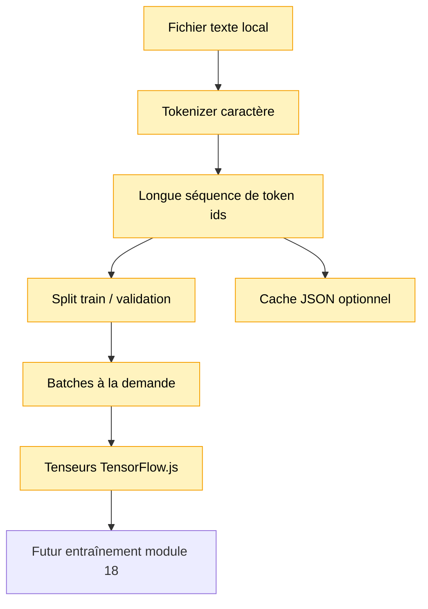

# Module 17 — Pipeline long corpus

Ce module prépare un fichier texte plus long pour l’entraînement, sans entraîner de modèle.

Il transforme:

```text
fichier texte -> tokenizer -> token ids -> split train/validation -> batches -> tenseurs
```

Le corpus long reste local et privé. Il ne doit pas être versionné dans Git.

## Pourquoi ce module existe

Le module 18 devra entraîner un petit modèle sur davantage de texte. Avant cela, il faut préparer
proprement les données:

- lire un fichier texte local;
- construire un vocabulaire;
- encoder le texte en ids;
- séparer train et validation;
- produire des batches next-token;
- convertir ces batches en tenseurs TensorFlow.js.

Le point important: on ne crée pas tous les exemples en mémoire. Avec un corpus de plusieurs
millions de tokens, cela deviendrait vite énorme.

## Schéma progressif



## Concepts

- **Corpus brut**: texte lisible par un humain.
- **Tokenizer**: transforme le texte en ids numériques.
- **Token ids**: longue séquence d’entiers, par exemple `[12, 4, 9, ...]`.
- **Exemple next-token**: contexte de `contextLength` tokens, puis cible à prédire.
- **Batch**: plusieurs exemples regroupés pour un entraînement plus efficace.
- **Train split**: partie utilisée pour apprendre.
- **Validation split**: partie gardée de côté pour mesurer si le modèle généralise un peu.
- **Tensor batch**: version TensorFlow.js du batch, prête pour le module 18.

## Pourquoi générer les batches à la demande

Si un corpus contient `20M` tokens et que `contextLength = 128`, on peut créer presque `20M`
exemples next-token.

Matérialiser tous ces exemples sous forme de tableaux dupliqués serait très coûteux en RAM. À la
place, ce module garde la séquence de tokens et produit les batches quand on les demande:

```text
tokens[i : i + contextLength] -> tokens[i + contextLength]
```

## Corpus local privé

Place un corpus long local ici:

```text
data/private/long-corpus.txt
```

Le dossier `data/private/` est ignoré par Git. Cela évite de versionner un livre, un dataset privé
ou un texte protégé par droit d’auteur.

Si ce fichier n’existe pas, la démo utilise `data/tiny-corpus.txt` pour rester exécutable partout.

## Cache dataset optionnel

Le module peut écrire un cache JSON dans:

```text
data/cache/long-corpus.dataset.json
```

Ce cache contient le vocabulaire, les tokens, les splits, les stats et les options utilisées. Il est
lisible et pédagogique, mais il n’est pas optimal pour de très gros corpus: un JSON avec des
millions d’entiers peut devenir lourd.

Le dossier `data/cache/` est ignoré par Git.

## API

Le module expose:

- `loadLongCorpusText()` pour lire un fichier UTF-8 et calculer ses stats;
- `createLongCorpusPipeline()` pour encoder et préparer les splits;
- `estimateNextTokenExampleCount()` pour estimer les exemples possibles;
- `iterateNextTokenBatches()` pour produire les batches à la demande;
- `nextTokenBatchToTensors()` pour convertir un batch en `tf.Tensor2D` + `tf.Tensor1D`;
- `disposeTensorNextTokenBatch()` pour libérer les tenseurs;
- `savePreparedLongCorpusDataset()` et `loadPreparedLongCorpusDataset()` pour un cache JSON simple.

## Exemple

```ts
import { createCharacterTokenizer } from '../01-tokenizer-simple/index.js'
import {
    createLongCorpusPipeline,
    iterateNextTokenBatches,
    loadLongCorpusText,
    nextTokenBatchToTensors,
} from './index.js'

const corpus = await loadLongCorpusText('data/private/long-corpus.txt')
const tokenizer = createCharacterTokenizer(corpus.rawText)
const pipeline = createLongCorpusPipeline(corpus.rawText, tokenizer)
const firstBatch = iterateNextTokenBatches(pipeline.trainTokenIds, {
    batchSize: pipeline.batchSize,
    contextLength: pipeline.contextLength,
}).next().value

if (firstBatch !== undefined) {
    const tensorBatch = nextTokenBatchToTensors(firstBatch)

    console.info(tensorBatch.inputTokenIds.shape)
    console.info(tensorBatch.targetTokenIds.shape)
}
```

Pour lancer la démo:

```bash
npm run demo:17-long-corpus
```

Dans un terminal interactif, la démo permet aussi d’inspecter la préparation du dataset:

```text
example 12
batch 3
context 64
```

- `example <index>` affiche un couple `contexte -> cible` du split train.
- `batch <index>` affiche plusieurs exemples regroupés dans un batch.
- `context <taille>` recalcule la pipeline avec un autre `contextLength` pour montrer l’effet sur
  le nombre d’exemples et la mémoire approximative d’un batch.

Appuie sur `ESC` pour quitter le mode interactif.

## Impact mémoire / VRAM

Ce module charge encore le texte complet et la séquence de tokens en RAM CPU. C’est volontaire:
l’objectif est la compréhension.

La VRAM reste à `0` tant que les batches ne sont pas convertis en tenseurs. Quand on appelle
`nextTokenBatchToTensors`, seul le batch courant devient un tenseur TensorFlow.js. Si le backend GPU
est chargé, ce batch pourra utiliser le backend GPU disponible.

## Limites

- Pas de streaming depuis disque.
- Cache JSON lisible mais peu efficace pour les très gros corpus.
- Tokenizer caractère encore limité.
- Pas d’entraînement dans ce module.
- Pas de mélange aléatoire des batches.
- Pas de format binaire optimisé.
