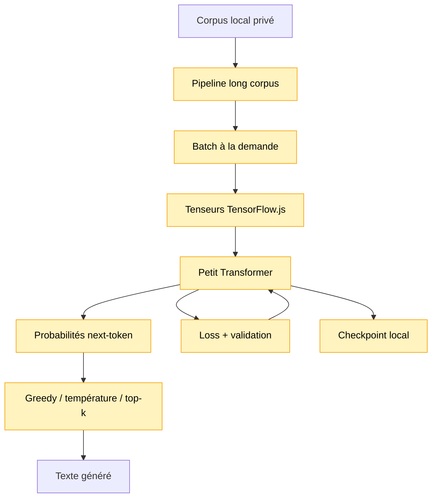

# Module 18 — Entraînement d’un petit modèle réel sur corpus long

Ce module entraîne un petit Transformer TensorFlow.js sur un corpus local plus long, avec des
batches produits à la demande, une validation, plusieurs stratégies de sampling et un checkpoint
simple.

Il transforme:

```text
corpus -> pipeline -> batch -> Transformer -> loss -> optimizer -> validation -> génération -> checkpoint
```

## Pourquoi ce module existe

Le module 14 montrait un mini Transformer entraînable, mais il travaillait sur un mini corpus et
matérialisait tous les exemples en mémoire.

Ici, on passe à une boucle plus proche d’un vrai entraînement:

- le corpus long reste dans `data/private/`;
- le module 17 prépare les token ids et les batches;
- le modèle reçoit un batch à la fois;
- la loss est calculée puis utilisée par TensorFlow.js pour mettre à jour les poids;
- la validation vérifie l’évolution sur une partie mise de côté;
- un checkpoint permet de sauvegarder les poids entraînés.

## Schéma progressif



## Concepts

- **Entraînement par batch**: on ne charge qu’un petit groupe d’exemples à la fois dans
  TensorFlow.js.
- **Epoch partielle**: la démo limite volontairement le nombre de batches pour éviter un
  entraînement trop long.
- **Validation loss**: loss calculée sur des tokens non utilisés pour les updates.
- **Checkpoint**: sauvegarde locale des options du modèle et de ses poids.
- **Backend TensorFlow.js**: moteur d’exécution des tenseurs. Si `@tensorflow/tfjs-node-gpu` est
  disponible, TensorFlow.js peut utiliser CUDA; sinon la démo reste compatible avec `@tensorflow/tfjs`.
- **Sampling**: ne modifie pas le modèle. Il change seulement la façon de choisir le prochain token
  à partir des probabilités.
- **Progression d’entraînement**: la démo affiche régulièrement l’epoch, le pourcentage de batches
  traités, la loss du dernier batch et le temps écoulé. Cela ne change pas l’apprentissage; c’est
  juste un indicateur pour savoir que le processus avance.
- **Ordre des batches**: par défaut, la démo utilise `batchOrder: "shuffled"` pour parcourir des
  zones différentes du corpus. Le mélange est pseudo-aléatoire mais déterministe grâce à
  `shuffleSeed`, donc deux lancements avec la même config restent reproductibles.

## Modèle

Le modèle reste volontairement petit:

```text
token ids
-> token embeddings + position embeddings
-> N blocs Transformer causaux
-> dernier vecteur du contexte
-> logits vocabulaire
-> softmax
```

Les options importantes sont:

- `contextLength`: nombre de tokens vus avant de prédire le suivant;
- `embeddingDimension`: taille des vecteurs internes;
- `feedForwardDimension`: largeur du feed-forward;
- `layerCount`: nombre de blocs Transformer;
- `batchSize`: nombre d’exemples par update.

## Génération

Le module réutilise les stratégies du module 11:

- `greedy`: choisit toujours le token le plus probable;
- `temperature`: tire un token après ajustement de la distribution;
- `topK`: garde les `k` candidats les plus probables, puis tire parmi eux.

La démo compare plusieurs sorties après entraînement pour montrer que le même modèle peut produire
des textes différents selon la stratégie de sampling.

## Checkpoints versionnés

La sauvegarde est locale et pédagogique:

```text
data/checkpoints/small-real-model/v1/
data/checkpoints/small-real-model/v2/
data/checkpoints/small-real-model/v3/
```

Le dossier `data/checkpoints/` est ignoré par Git. Chaque version contient:

- `metadata.json`;
- un fichier `.bin` par variable TensorFlow.js.

Ce format est simple à lire et utile pour apprendre, mais ce n’est pas un format production.

La démo ne modifie pas le fichier JSON de configuration. Elle lit les versions déjà présentes dans
`checkpointPath`, puis choisit quoi charger et où sauvegarder:

- sans `checkpointVersion`, elle charge la plus grande version disponible, par exemple `v3`;
- sans version existante, elle entraîne depuis zéro et sauvegarde en `v1`;
- avec `checkpointVersion: "v2"`, elle charge précisément `v2`;
- avec `--continue-train`, elle charge la version demandée ou la plus récente, puis sauvegarde dans
  une nouvelle version `vMax + 1`;
- avec `--force-train`, elle part de zéro; sans `checkpointVersion`, elle sauvegarde aussi dans une
  nouvelle version `vMax + 1`.

## Exemple

```ts
import { createCharacterTokenizer } from '../01-tokenizer-simple/index.js'
import { createLongCorpusPipeline } from '../17-long-corpus-pipeline/index.js'
import {
    createSmallLanguageModel,
    generateSmallLanguageModelText,
    trainSmallLanguageModel,
} from './index.js'

const tokenizer = createCharacterTokenizer(rawText)
const pipeline = createLongCorpusPipeline(rawText, tokenizer, {
    batchSize: 16,
    contextLength: 128,
})
const model = createSmallLanguageModel({
    contextLength: 128,
    embeddingDimension: 64,
    feedForwardDimension: 256,
    layerCount: 1,
    vocabularySize: tokenizer.vocabularySize,
})

trainSmallLanguageModel(model, pipeline, {
    epochs: 1,
    learningRate: 0.001,
    batchOrder: 'shuffled',
    shuffleSeed: 18,
    maxTrainBatchesPerEpoch: 30,
    onProgress: (progress) => {
        console.info(
            `epoch ${progress.epoch}/${progress.epochs} - ${Math.round(
                progress.progressRatio * 100,
            )}%`,
        )
    },
})

const result = generateSmallLanguageModelText(model, tokenizer, prompt, {
    maxNewTokens: 160,
    strategy: 'topK',
    topK: 5,
    seed: 123,
})

console.info(result.text)
```

Pour lancer la démo:

```bash
npm run demo:18-small-real-model
```

Au premier lancement, la démo entraîne le modèle et écrit un checkpoint local. Aux lancements
suivants, si ce checkpoint est compatible avec le corpus et la configuration courants, la démo le
recharge directement pour générer du texte sans réentraîner.

Pour forcer un nouvel entraînement depuis zéro:

```bash
npm run demo:18-small-real-model:train
```

Pour continuer l’entraînement depuis la version choisie:

```bash
npm run demo:18-small-real-model:continue
```

Les scripts utilisent des arguments CLI. Les équivalents directs sont:

```bash
npm run demo:18-small-real-model -- --continue-train
npm run demo:18-small-real-model -- --force-train
```

Les réglages d’entraînement viennent du fichier JSON de configuration. Il n’y a donc plus de profil
CLI séparé: pour rendre un entraînement plus long, modifie `epochs`, `maxTrainBatchesPerEpoch`,
`batchSize` ou les dimensions du modèle dans la config.

Avant d’entraîner sur un texte extrait d’un livre/PDF, il est souvent utile de nettoyer les retours
à la ligne artificiels:

```bash
npm run corpus:clean -- --path data/private/long-corpus.txt
```

Puis utilise le fichier nettoyé dans la config:

```json
{
    "corpusPath": "data/private/long-corpus.clean.txt"
}
```

Pendant l’entraînement, la démo affiche une progression du type:

```text
epoch  1/3 |  40% | batch 80/200 | loss batch 2.9134 | 1min 12s
```

À la fin, elle affiche aussi la durée totale d’entraînement. Sur GPU, les premiers batches peuvent
prendre plus de temps à cause de l’initialisation du backend; l’important est de voir les batches
avancer.

## Configuration de démo

La démo cherche un fichier local:

```text
data/private/module-18-config.json
```

Ce fichier est ignoré par Git. Tu peux partir de l’exemple versionné:

```text
src/modules/18-small-real-model-training/demo-config.example.json
```

Il existe aussi un exemple plus ambitieux pour GPU:

```text
src/modules/18-small-real-model-training/demo-config.gpu.example.json
```

Cette configuration GPU augmente notamment `embeddingDimension`, `feedForwardDimension`,
`layerCount` et `maxTrainBatchesPerEpoch`. Elle reste indicative: selon la VRAM disponible, il peut
falloir réduire `batchSize` ou `embeddingDimension`.

Exemple de configuration:

```json
{
    "corpusPath": "data/private/long-corpus.txt",
    "checkpointPath": "data/checkpoints/small-real-model",
    "checkpointVersion": "v1",
    "contextLength": 128,
    "batchSize": 16,
    "embeddingDimension": 64,
    "feedForwardDimension": 256,
    "layerCount": 1,
    "epochs": 3,
    "learningRate": 0.001,
    "batchOrder": "shuffled",
    "shuffleSeed": 18,
    "maxTrainBatchesPerEpoch": 200,
    "maxValidationBatches": 10,
    "maxNewTokens": 160,
    "validationRatio": 0.05
}
```

Chaque champ contrôle un compromis précis:

| Champ                     | Rôle                                                       | Impact principal                                                        |
| ------------------------- | ---------------------------------------------------------- | ----------------------------------------------------------------------- |
| `corpusPath`              | Chemin du fichier texte utilisé pour l’entraînement.       | Change complètement le vocabulaire, les tokens et les exemples.         |
| `checkpointPath`          | Dossier racine où ranger les checkpoints.                  | Permet de séparer les checkpoints du reste du projet.                   |
| `checkpointVersion`       | Version précise à charger, par exemple `v2`.               | Optionnel; absent = charger automatiquement la version la plus récente. |
| `contextLength`           | Nombre de tokens donnés au modèle pour prédire le suivant. | Plus grand = plus de contexte, mais attention plus coûteuse en mémoire. |
| `batchSize`               | Nombre d’exemples entraînés à chaque update.               | Plus grand = updates plus stables, mais plus de RAM/VRAM.               |
| `embeddingDimension`      | Taille des vecteurs internes de tokens et positions.       | Plus grand = modèle plus expressif, mais plus de paramètres.            |
| `feedForwardDimension`    | Largeur de la petite couche feed-forward dans chaque bloc. | Plus grand = transformation locale plus riche, mais plus de paramètres. |
| `layerCount`              | Nombre de blocs Transformer empilés.                       | Plus grand = modèle plus profond, mais entraînement plus lent.          |
| `epochs`                  | Nombre de passages sur les batches sélectionnés.           | Plus grand = plus d’apprentissage, mais plus de temps.                  |
| `learningRate`            | Taille des corrections appliquées aux poids.               | Trop petit = lent; trop grand = entraînement instable.                  |
| `batchOrder`              | Ordre des batches: `sequential` ou `shuffled`.             | `shuffled` évite de revoir toujours le début du corpus en premier.      |
| `shuffleSeed`             | Seed utilisée pour mélanger les batches.                   | Même seed = mélange reproductible; la version du checkpoint la décale.  |
| `maxTrainBatchesPerEpoch` | Limite le nombre de batches entraînés par epoch.           | Permet de contrôler la durée de la démo.                                |
| `maxValidationBatches`    | Limite le nombre de batches utilisés pour la validation.   | Validation plus rapide, mais estimation moins complète.                 |
| `maxNewTokens`            | Nombre de tokens générés après le prompt.                  | Plus grand = sortie plus longue, mais génération plus lente.            |
| `validationRatio`         | Part du corpus gardée pour la validation.                  | Mesure la loss sur du texte non utilisé pour les updates.               |

Le trio le plus sensible pour la mémoire est:

```text
batchSize x contextLength x embeddingDimension
```

Et l’attention dépend fortement de:

```text
contextLength x contextLength
```

Avec `batchOrder: "shuffled"`, la démo mélange les indices de batches, pas tous les exemples un par
un. C’est un compromis: on évite de matérialiser des millions d’exemples, tout en visitant des zones
plus variées du corpus. Quand tu lances `--continue-train`, la version de checkpoint change, donc la
seed effective change aussi automatiquement. Tu n’as pas besoin de modifier la config à chaque
continuation.

Avec `batchOrder: "sequential"`, la démo parcourt les batches dans l’ordre naturel du corpus et
commence toujours au début du split train. Si `maxTrainBatchesPerEpoch` est petit, cela signifie que
chaque lancement ou continuation revoit surtout les mêmes premiers passages. Ce mode est utile pour
déboguer ou comparer un comportement très déterministe, mais il est généralement moins intéressant
pour entraîner sur un corpus long. Il ne décale pas automatiquement le point de départ.

Tu peux aussi choisir un fichier de config ou un corpus via arguments:

```bash
npm run demo:18-small-real-model -- --config data/private/ma-config.json
npm run demo:18-small-real-model -- --corpus data/private/mon-corpus.txt
```

Si `checkpointVersion` vaut `"v1"`, la démo cherche cette version dans:

```text
data/checkpoints/small-real-model/v1/
```

Pour continuer depuis cette version, garde le même `checkpointPath` et la même `checkpointVersion`,
puis lance:

```bash
npm run demo:18-small-real-model -- --config data/private/ma-config.json --continue-train
```

La démo chargera `v1`, entraînera encore, puis sauvegardera dans une nouvelle version, par exemple
`v2` ou `v4` selon les dossiers déjà présents. Elle n’écrase donc pas la version de départ.

Si `checkpointVersion` est absent, la démo utilise automatiquement la plus grande version
disponible. C’est pratique pour continuer “la dernière expérience” sans modifier la config. Pour
revenir à une ancienne version, ajoute explicitement:

```json
{
    "checkpointVersion": "v2"
}
```

## Prompts interactifs

Le modèle a besoin de `contextLength` tokens pour générer. Taper `128` caractères à la main serait
pénible, donc le mode interactif aide à construire un contexte valide.

Si tu tapes:

```text
greedy Harry
```

et que le prompt est trop court, la démo garde `Harry` et te demande d’ajouter du texte. Tu peux
continuer à écrire sans retaper la commande complète.

Si le prompt est trop long, la démo ne demande pas de tout recommencer: elle garde simplement les
`contextLength` derniers tokens, parce que c’est exactement ce que voit le modèle au moment de
prédire le prochain token.

Pendant la saisie interactive:

- `Retour arrière` corrige la ligne courante;
- `Ctrl+U` efface la ligne courante;
- `ESC` quitte la démo.

Elle affiche clairement:

```text
prompt utilisateur
prompt utilisé
```

## Impact mémoire / VRAM

La RAM CPU contient encore le texte et les token ids du corpus. La VRAM dépend surtout de:

```text
batchSize
contextLength
embeddingDimension
feedForwardDimension
layerCount
```

Le coût de l’attention évolue avec:

```text
contextLength x contextLength
```

Avec `contextLength = 128`, cela reste raisonnable pour un petit modèle, mais augmenter le batch,
les dimensions ou le nombre de couches peut vite augmenter la mémoire.

## Limites

- Tokenizer caractère uniquement.
- Pas de top-p.
- Pas de streaming disque complet.
- Pas de LayerNorm entraînable.
- Pas de sauvegarde compatible production.
- Qualité limitée par la taille du corpus et par les dimensions prudentes.
- L’objectif reste l’apprentissage, pas l’entraînement d’un modèle compétitif.
