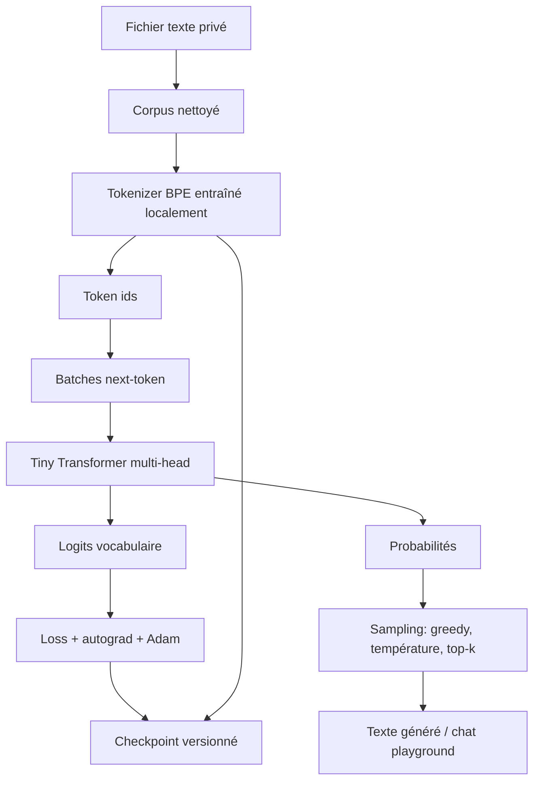

# Module 19 — Tiny LLM final avec BPE, long corpus et chat playground

Ce module clôt la progression principale du projet. Il assemble les briques vues avant:
préparation d’un corpus long, tokenizer, batches, Transformer, autograd TensorFlow.js,
sampling, checkpoints versionnés et interface de génération.

L’objectif reste pédagogique. Le modèle peut apprendre des motifs et le style d’un corpus
local, mais il ne devient pas un assistant fiable. Le mode chat est un playground de
génération: il formate un prompt conversationnel, puis le modèle continue le texte.
Si le tokenizer ne connaît pas les caractères des labels `Utilisateur:` / `Assistant:`, le
playground repasse sur le texte saisi directement. C’est fréquent avec la config mini, car le
mini corpus ne contient pas forcément les majuscules ou les deux-points.

## Schéma progressif



## Pourquoi introduire BPE ?

Un tokenizer caractère est excellent pour apprendre, mais il gaspille beaucoup de contexte:
`bonjour` devient sept tokens. Avec BPE, le tokenizer apprend des morceaux fréquents du
corpus. Selon le corpus, `bonjour`, ` le`, `tion` ou d’autres séquences peuvent devenir des
tokens uniques.

Conséquence pratique:

```text
Tokenizer caractère: contexte 128 = 128 caractères environ
Tokenizer BPE:        contexte 128 = souvent beaucoup plus de texte utile
```

Le BPE de ce module reste simple: il part des caractères, trouve les paires les plus fréquentes,
puis les fusionne de manière déterministe. Ce n’est pas une implémentation production, mais le
mécanisme devient visible.

Pour éviter que le tokenizer utilise son vocabulaire sur des fragments trop anecdotiques, trois
garde-fous sont configurables: fréquence minimale d’un merge, longueur maximale d’un token fusionné,
et nombre maximal de caractères blancs dans un token fusionné. Sur un corpus long, des valeurs comme
`bpeMinimumMergeCount: 10`, `bpeMaximumMergedTokenLength: 24` et
`bpeMaximumSpacesInMergedToken: 1` évitent d’apprendre des bouts de phrases trop spécifiques.

## Architecture du modèle

```text
tokens
-> token embeddings + position embeddings
-> blocs Transformer pre-LayerNorm
   -> multi-head causal self-attention
   -> residual
   -> feed-forward
   -> residual
-> dernier vecteur contextualisé
-> logits vocabulaire
-> softmax / loss / sampling
```

Différences importantes avec le module 18:

- le tokenizer BPE remplace le tokenizer caractère;
- l’attention devient multi-head;
- chaque bloc utilise une pre-LayerNorm;
- le checkpoint sauvegarde aussi le tokenizer;
- la CLI propose entraînement, génération ponctuelle et chat playground.

## Scripts

```bash
npm run demo:19-final-llm
npm run llm:train -- --config data/private/final-llm-config.json
npm run llm:chat -- --config data/private/final-llm-config.json
npm run llm:generate -- --config data/private/final-llm-config.json --prompt "Utilisateur: Bonjour\nAssistant:"
```

| Commande                                                 | Rôle                                                                                                                                                                  | Quand l’utiliser                                                                     |
| -------------------------------------------------------- | --------------------------------------------------------------------------------------------------------------------------------------------------------------------- | ------------------------------------------------------------------------------------ |
| `npm run demo:19-final-llm`                              | Lance une démonstration courte avec la config mini versionnée.                                                                                                        | Pour vérifier que le module fonctionne sans préparer de corpus privé.                |
| `npm run llm:train -- --config <path>`                   | Entraîne le modèle. S’il existe déjà un checkpoint compatible, la commande continue automatiquement depuis la version chargée et sauvegarde dans la version suivante. | Pour créer `v1`, puis continuer vers `v2`, `v3`, etc.                                |
| `npm run llm:train -- --config <path> --force-train`     | Ignore les checkpoints existants et démarre un nouveau modèle, sauvegardé dans la prochaine version libre.                                                            | Pour repartir de zéro après changement de corpus, de tokenizer ou d’hyperparamètres. |
| `npm run llm:chat -- --config <path>`                    | Charge le checkpoint demandé ou le plus récent, puis ouvre un playground conversationnel.                                                                             | Pour tester le modèle après entraînement.                                            |
| `npm run llm:generate -- --config <path> --prompt "..."` | Charge un checkpoint et génère une sortie ponctuelle non interactive.                                                                                                 | Pour comparer rapidement des prompts ou automatiser des essais.                      |

Arguments supportés:

| Argument                      | Commandes concernées             | Effet                                                                                                                                   |
| ----------------------------- | -------------------------------- | --------------------------------------------------------------------------------------------------------------------------------------- |
| `--config <path>`             | toutes                           | Chemin vers un fichier JSON de configuration. Si absent, la CLI cherche `data/private/final-llm-config.json`.                           |
| `--prompt "..."`              | `llm:generate`                   | Prompt de départ pour une génération ponctuelle.                                                                                        |
| `--force-train`               | `llm:train`, `demo:19-final-llm` | Force un nouvel entraînement depuis zéro dans une nouvelle version de checkpoint.                                                       |
| `--dataset-cache-from <path>` | `llm:train`, `demo:19-final-llm` | Importe le cache tokenisé et le tokenizer d’un autre checkpoint, d’un dossier `dataset-cache`, ou d’un fichier `tokenized-corpus.json`. |

Avant un entraînement sérieux, nettoie ton corpus:

```bash
npm run corpus:clean -- --path data/private/long-corpus.txt --keep-paragraphs
```

Le corpus long reste local et privé dans `data/private/`.

## Config

Trois exemples sont fournis:

- `demo-config.mini.example.json`: petit test rapide sur `data/tiny-corpus.txt`;
- `demo-config.example.json`: configuration prudente pour corpus privé;
- `demo-config.gpu.example.json`: configuration plus ambitieuse si le backend GPU fonctionne.

Champs principaux:

| Champ                             | Type / valeurs                               | Rôle                                                                                                                   | Impact principal                                                                |
| --------------------------------- | -------------------------------------------- | ---------------------------------------------------------------------------------------------------------------------- | ------------------------------------------------------------------------------- |
| `corpusPath`                      | chemin `.txt`                                | Fichier local utilisé pour entraîner le tokenizer BPE et le modèle.                                                    | Change totalement le vocabulaire et les motifs appris.                          |
| `checkpointPath`                  | chemin dossier                               | Dossier racine où créer `v1`, `v2`, etc.                                                                               | Permet de garder plusieurs versions du modèle.                                  |
| `checkpointVersion`               | optionnel, `"v1"`, `"v2"`...                 | Version précise à charger. Si absent, la dernière version disponible est utilisée.                                     | Utile pour comparer ou continuer depuis une ancienne version.                   |
| `bpeVocabularySize`               | entier positif                               | Taille cible du vocabulaire BPE.                                                                                       | Plus grand = moins de tokens par texte, mais sortie vocabulaire plus coûteuse.  |
| `bpeMaxTrainingCharacters`        | entier positif                               | Portion du corpus utilisée pour apprendre les merges BPE. Les caractères de base restent collectés sur tout le corpus. | Plus grand = tokenizer plus représentatif, mais entraînement BPE plus long.     |
| `bpeMinimumMergeCount`            | entier positif                               | Fréquence minimale d’une paire pour créer un nouveau token BPE.                                                        | Évite de gaspiller le vocabulaire avec des fragments trop rares.                |
| `bpeMaximumMergedTokenLength`     | entier positif                               | Longueur maximale d’un token créé par merge BPE.                                                                       | Évite les tokens très longs et trop spécifiques au corpus.                      |
| `bpeMaximumSpacesInMergedToken`   | entier positif ou nul                        | Nombre maximal de caractères blancs autorisés dans un token créé par merge BPE.                                        | Limite les tokens qui traversent trop de mots, lignes ou paragraphes.           |
| `contextLength`                   | entier positif                               | Nombre de tokens BPE vus pour prédire le suivant.                                                                      | Coût attention en `contextLength x contextLength`.                              |
| `batchSize`                       | entier positif                               | Nombre d’exemples entraînés ensemble.                                                                                  | Plus grand = plus stable, mais plus de RAM/VRAM.                                |
| `embeddingDimension`              | entier positif                               | Taille des vecteurs internes.                                                                                          | Augmente fortement paramètres et activations.                                   |
| `headCount`                       | entier positif divisant `embeddingDimension` | Nombre de têtes d’attention.                                                                                           | Plusieurs vues du contexte, coût proche mais organisation différente.           |
| `layerCount`                      | entier positif                               | Nombre de blocs Transformer.                                                                                           | Plus de capacité, mais entraînement plus lent et plus gourmand.                 |
| `feedForwardDimension`            | entier positif                               | Taille cachée du feed-forward.                                                                                         | Souvent environ `embeddingDimension * 4`.                                       |
| `epochs`                          | entier positif                               | Nombre de passages sur les batches sélectionnés.                                                                       | Plus élevé = plus d’apprentissage, mais risque de surapprentissage.             |
| `learningRate`                    | nombre positif                               | Taille des corrections Adam.                                                                                           | Trop haut peut dégrader la loss; trop bas apprend lentement.                    |
| `maxTrainBatchesPerEpoch`         | entier positif                               | Nombre maximum de batches entraînés par epoch.                                                                         | Contrôle le temps; une epoch peut être volontairement partielle.                |
| `maxValidationBatches`            | entier positif                               | Nombre de batches utilisés pour estimer la validation.                                                                 | Plus grand = mesure plus fiable, mais plus lente.                               |
| `saveBestEpochOnly`               | booléen optionnel, défaut `false`            | Si `true`, restaure les meilleurs poids du run avant de sauvegarder le checkpoint.                                     | Évite de sauvegarder une dernière epoch moins bonne que la meilleure epoch.     |
| `skipCheckpointWhenNoImprovement` | booléen optionnel, défaut `false`            | Si `true`, ne sauvegarde pas de nouvelle version si aucune epoch ne bat la validation initiale.                        | Évite d’empiler des checkpoints qui n’améliorent pas le modèle.                 |
| `validationRatio`                 | nombre `>= 0` et `< 1`                       | Part du corpus gardée pour validation.                                                                                 | Sert à détecter si le modèle mémorise sans généraliser.                         |
| `batchOrder`                      | `"shuffled"` ou `"sequential"`               | Ordre de lecture des batches.                                                                                          | `shuffled` explore différentes zones; `sequential` suit le corpus dans l’ordre. |
| `shuffleSeed`                     | entier positif                               | Seed du shuffle.                                                                                                       | Rend l’ordre pseudo-aléatoire reproductible.                                    |
| `maxNewTokens`                    | entier positif                               | Nombre de tokens générés après le prompt.                                                                              | Plus grand = génération plus longue.                                            |
| `strategy`                        | `"greedy"`, `"temperature"`, `"topK"`        | Stratégie de sélection du prochain token.                                                                              | Change la variété de la génération, pas les poids du modèle.                    |
| `temperature`                     | nombre positif                               | Aplatissement ou concentration des probabilités.                                                                       | Bas = plus prudent; haut = plus varié.                                          |
| `topK`                            | entier positif                               | Nombre de candidats gardés en stratégie `topK`.                                                                        | Limite les choix aux tokens les plus probables.                                 |
| `repetitionPenalty`               | nombre positif, `1` = désactivé              | Divise la probabilité des tokens déjà vus récemment avant le sampling.                                                 | Réduit les boucles et répétitions trop visibles.                                |
| `repetitionWindow`                | entier positif                               | Nombre de tokens récents à regarder pour appliquer `repetitionPenalty`.                                                | Plus grand = pénalise les répétitions sur un contexte plus large.               |
| `noRepeatNgramSize`               | entier positif ou nul, `0` = désactivé       | Bloque les tokens qui recréeraient un n-gram déjà généré dans le contexte courant.                                     | `3` évite par exemple de répéter exactement le même trigramme.                  |
| `seed`                            | entier positif                               | Seed du sampling.                                                                                                      | Rend les générations probabilistes reproductibles.                              |
| `prompt`                          | chaîne                                       | Prompt par défaut utilisé par la démo.                                                                                 | Doit utiliser des caractères connus du tokenizer.                               |

## Checkpoints versionnés

Les checkpoints sont sauvegardés dans:

```text
data/checkpoints/final-tiny-llm/v1/
data/checkpoints/final-tiny-llm/v2/
...
```

Le corpus tokenisé est mis en cache au niveau du dossier racine du checkpoint:

```text
data/checkpoints/final-tiny-llm/
  dataset-cache/
    tokenized-corpus.json
  v1/
  v2/
```

Ce cache contient les `tokenIds` du corpus, plus un hash du corpus et du tokenizer. Il est partagé
par les versions `v1`, `v2`, etc. Si le cache manque, s’il a été supprimé, ou si le corpus/tokenizer
ne correspond plus, la CLI réencode le corpus puis recrée le cache. Le checkpoint reste donc
chargeable même sans cache; le cache sert uniquement à accélérer les reprises d’entraînement.

Pour démarrer un nouveau checkpoint à partir d’un corpus déjà tokenisé ailleurs, utilise:

```bash
npm run llm:train -- --config data/private/final-llm-config.json --dataset-cache-from data/checkpoints/autre-checkpoint
```

Cette option copie le cache dans le nouveau `checkpointPath` et le considère compatible sans comparer
le hash du tokenizer. Quand aucun modèle n’est encore chargé dans le nouveau checkpoint, elle importe
aussi le `tokenizer.json` de la dernière version du checkpoint source, avant l’étape qui entraînerait
normalement un nouveau tokenizer BPE. Elle est pratique quand tu sais que le corpus et la configuration
BPE sont les mêmes, mais elle peut produire un entraînement incohérent si le cache vient d’un tokenizer
différent.

Chaque version contient:

- `metadata.json`;
- `tokenizer.json`;
- les poids TensorFlow.js en fichiers binaires simples;
- la config et les métriques dans `metadata.extra`.

Si aucune version n’est demandée, la CLI recharge la dernière version disponible. Avec
`llm:train`, elle continue automatiquement l’entraînement depuis cette version et sauvegarde dans
la prochaine version libre. `--force-train` permet de repartir de zéro sans écraser les anciennes
versions.

Avec `saveBestEpochOnly: true`, la commande évalue la validation loss après chaque epoch. Si une
epoch intermédiaire est meilleure que la dernière, les poids de cette meilleure epoch sont restaurés
juste avant la sauvegarde. Si aucune epoch ne bat le point de départ, les poids initiaux du run sont
restaurés: cela évite d’écraser une bonne version par un entraînement qui dégrade la validation.

Avec `skipCheckpointWhenNoImprovement: true`, aucune nouvelle version n’est écrite si la meilleure
validation loss du run ne fait pas mieux que la validation loss initiale. C’est pratique pour les
longs entraînements itératifs: une tentative ratée ne crée pas de checkpoint inutile.

## Limites

- Modèle entraîné from scratch sur un corpus local, souvent petit.
- Pas d’instruction tuning.
- Pas de RAG.
- Pas de mémoire de conversation réelle.
- Peut halluciner, répéter ou mélanger des styles.
- Le chat est une interface de génération, pas une garantie de réponse correcte.

## Mémoire / VRAM

Le coût principal vient de:

- paramètres: embeddings, projections Q/K/V/O, feed-forward, sortie vocabulaire;
- activations: `batchSize x contextLength x embeddingDimension`;
- attention: `batchSize x headCount x contextLength x contextLength`.

Le backend GPU est optionnel via le module 16. Sans backend natif, `@tensorflow/tfjs` reste utile
pour apprendre, mais l’entraînement long devient vite lent.
